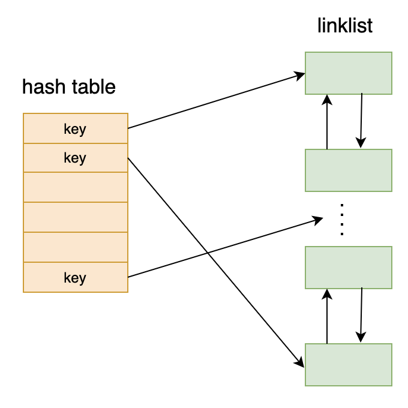

# Cache

[toc]

## 功能

该模块实现了一个缓存，缓存的键为c原生字符串，值为任意类型。该缓存使用方法和其他语言中的`map`基本一致，该缓存特性如下

- 预设缓存大小，放入的数据超出预设数量时会删除最久未访问的数据。
- `put`操作支持设置`TTL`，超过`TTL`的缓存条目会被删除。
- 该缓存支持并发读写（也许吧，我也不知道是不是完全正确.....）。
- 查询和插入的时间复杂度都是O(1)  ~~（*当然前提是hash函数足够好哈）*~~
- ~~一些未知的潜伏的bug~~


下面给出一个大致的原理图(不够具体，实际复杂一些)



---

## 接口

该模块由cache目录下的源文件实现，接口由`include/cache.h`导出，接口如下

```c
typedef struct cache {
    ...
} Cache;

// 创建一个最多存放maxSize个条目的缓存
// 传入的copy 和 delete可以为NULL
// 为NULL 则执行默认操作
Cache *CreateCache(int maxSize,void *(*copy)(void *data),void (*delete)(void *data));

// 销毁缓存
void DestroyCache(Cache *c);

// 将一个条目存入缓存中
// c 为先前创建的缓存 key为键 data为指向想要缓存数据的指针 size为要缓存数据的大小
// TTL为该缓存条目存活时间（秒）（这个时间不是指未使用该缓存的时间，而是指put进来之后能存活的时间）
// 若key与之前存放条目相同会覆盖之前的条目
void CachePut(Cache *c, char *key, void *data, size_t size, time_t TTL);

// 从缓存中取出一条数据
// c 为缓存 key为键
// 返回指向数据的指针
// 注意返回的指针指向的空间要由使用者自行释放！！！！（为了防止并发操作带来的冲突 所以返回的数据是额外拷贝的一份 交由使用者管理 故需要使用者释放）
void *CacheGet(Cache *c, char *key);
```
注意，`CreateCache`函数的`copy`和`delete`参数，当调用`CachePut`时，首先会尝试用`copy`函数作用于`data`,再将`copy`函数的返回值存起来。在缓存中某一缓存条目会被删除时，则会调用`delete`作用于存入的`data`指针。当调用`CacheGet`时，也会尝试用`copy`函数复制一份数据，并将指向该数据的指针返回给调用者，返回的空间交由调用者自行处理。

若`copy`和`delete`为`NULL`则有可以认为有如下两个默认的函数进行相应处理

```c
void *copy(void *data){
  void *res = malloc(size); // 该size即调用CachePut时传入的size
  memcpy(res,data,size);
  return res;
}

void delete(void *data){
  free(data);
}
```


---

## 示例

貌似没什么好的示例，上面的注释也许足够清晰了吧~~（懒）~~。