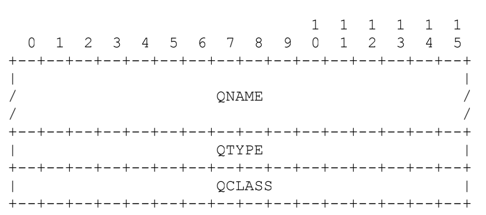

# 构造、解析DNS报文

[TOC]

## message结构

### DNS报文构成

报文头结构如下


各字段解释详见老师发的RFC1035.pdf第26页。

报头后紧接着的是`QDCOUNT`个questions,一条question结构如下



紧接着三个`RR section`,分别为`answer section`、`authority section`、`additional section`。每个`section`内有数条`RR (resource record)`,条目数分别为报头中的`ANCOUNT`、`NSCOUNT`、`ARCOUNT`。一条`RR`的结构如下


### 报文结构定义

```c
// RR section
#define ANSWER 0
#define AUTHORITY 1
#define ADDITIONAL 2

// message 结构
typedef struct msg{
    uint16_t ID; // 对应报头ID字段
    uint16_t flag; // 对应报头各个标志位
    uint16_t q_count; // 问题数
  // 下面为 answer section、authority section、additional section内RR条目数
    uint16_t RR_count[3]; // RR_count[ANSWER]代表answer段数量 以此类推 

    question *ques[MAX_SIZE]; // 对应question段的内容
    RR *resourse_record[3][MAX_SIZE]; // resourse_record[ANSWER]代表answer段，以此类推
}message;

//创建新报文
message *newMsg();

//释放一条message结构占用的空间
void destroyMsg(message *msg);
```

#### 构造报头

创建一条新报文代码如下

```c
message *msg = newMsg();  // 注意使用完后要用destroy函数释放空间
```

设置报文是请求报文或响应报文使用如下函数

```c
//设置报文为请求报文
void setQuery(message *msg);

//设置报文为响应报文
void setResp(message *msg);

// 下面是例子
setQuery(msg); // 将msg报文设为请求报文
setResp(msg);  // 将msg报文设为响应报文
```

设置报头中的opcode相关函数和宏如下(基本上都是设为QUERY的，其他的课程设计也用不到)

```c
//opcode
#define QUERY 0 //a standard query (QUERY)
#define IQUERY 1  //an inverse query (IQUERY)
#define STATUS 2  //a server status request (STATUS)

//设置操作码
void setOpcode(message *msg,uint16_t op);

// 示例 设置请求为标准请求
setOpcode(msg,QUERY);
```

设置其他一些标志位的相关函数和宏如下

```c
// flag
#define AA 5 //Authoritative Answer
#define TC 6 //TrunCation
#define RD 7 // Recursion Desired
#define RA 8 //Recursion Available
#define AD 10 //1 为应答服务器已经验证了该查询相关的 DNSSEC 数字签名 (RFC1035中没有)抓包看到的，网上查到的
#define CD 11 //1 为服务器并未进行相关 DNSSEC 数字签名的验证       (RFC1035中没有)抓包看到的，网上查到的

//设置某个标志位
//如要设置AA位，则这样调用  setFlag(msg,AA)
//相应的宏已经预先写好 包括 AA TC RD RA AD CD
void setFlag(message *msg,uint16_t b);
```

设置响应码`RCODE`的相关函数和宏如下

```c
//Rcode
#define NO_ERR 0 // no error
#define FMT_ERR 1 //Format error - The name server wasunable to interpret the query.
#define SERVER_FAILURE 2  //Server failure - The name server was unable to process this query due to a problem with the name server.
#define NAME_ERR 3 //domain name referenced in the query does not exist.

//设置响应码
void setRCODE(message *msg,uint16_t rcode);

// 示例 设置响应
setRCODE(msg,NAME_ERR); // 查无此名
```

以上就是构造报头相关的函数和宏，报头中的`QDCOUNT`、`ANCOUNT`、`NSCOUNT`、`ARCOUNT`不需要自己设置，在添加相关字段时会自动设置。

#### 为报文添加qestion

question 结构定义如下,一目了然，不做解释

```c
// question对应的结构
typedef struct ques{
    char q_name[MAX_LEN];
    uint16_t q_type;
    uint16_t q_class;
}question;
```

设置其字段的方法如下

```c
//type value
#define A 1
#define NS 2 //an authoritative name server
#define CNAME 5 //the canonical name for an alias
#define AAAA 28
// 以上是目前支持的资源类型

//class value
#define IN 1 //the Internet
#define CS 2 // the CSNET class (Obsolete - used only for examples in some obsolete RFCs)
#define CH 3 // the CHAOS class
#define HS 4 // Hesiod [Dyer 87]

//设置QNAME
void setQNAME(question *q,char *name);

// 示例 构建请求www.baidu.com A类型资源的question
question q;
setQNAME(&q,"www.baidu.com");
q.q_type = A ; // A类型请求
q.q_class = IN; //一般来说都是IN 其他类型不会碰到的
```

将question添加到报文相关函数如下

```c
//为报文添加一个问题
//失败返回0
int addQuestion(message *msg,question *q);

// 示例 
message *msg = newMsg();
...  //构造msg的首部
question q;
...  // 设置q的内容
addQuestion(msg,&q);// 将该问题添加到msg报文中
```

#### 为报文添加RR

RR的结构如下,该结构几乎和RFC1035中的RR结构一致

```c
// data type
#define STRING_TYPE 0
#define BINARY_TYPE 1

// resource record 对应的结构
typedef struct {
    char name[MAX_LEN];
    uint16_t type;   // 前面question 类型时已经见过 目前支持A AAAA CNAME NS
    uint16_t class;  // 几乎都是IN
    uint32_t TTL;
    uint16_t data_length;
    void *data;
    uint8_t data_type;
    char string_data[MAX_LEN]; //若data是字符串 比如CNAME NS等类型的RR
}RR;
```

设置其字段的方法如下

```c
//设置RR的name字段
void setRRName(RR *rr,char *s);

//设置RR的data字段为字符串
void setRRNameData(RR *rr,char *name);

//设置RR的data字段 二进制数据
void setRRData(RR *rr,void *data,size_t size);
// name和data一定要用上面几个函数设置，千万不要直接修改结构体成员

// 其余的字段type class TTL 直接设置即可 如
RR r;
r.type = CNAME;
r.class = IN;
r.TTL = 4000;
```

添加`RR`的函数如下

```c
// RR section
#define ANSWER 0
#define AUTHORITY 1
#define ADDITIONAL 2

// 添加一条资源记录
// 可以选择添加到 ANSWER AUTHORITY ADDITIONAL中的一段，由第三个参数标识
// 如可以这样用 addRR(msg,q,ANSWER)
int addRR(message *msg,RR *q,int type);

// 示例：向answer section 添加一条RR
message *msg = newMsg();
...//构造msg其他字段
RR r;
r.type = CNAME;
r.class = IN;
r.TTL = 4000;
setRRName(&r,"www.baidu.com");
setRRNameData(&r,"shifen.hahalala.wawa.ii");
addRR(msg,&r,ANSWER);
```

## 将message结构变为可发送报文

用前文提到的方法构造好了`message`结构后，可以通过一些方法将其转化为可直接发送的报文

```c
//将msg结构编码为可以实际发送的报文
//注意给够buff的长度
//否则会段错误，这里为了方便默认buff长度足够
//返回报文的长度 出错则返回-1
ssize_t encode(message *msg,void *buff);

//将收到的报文buff变为结构体
message *decode(void *buff);

//调试用，打印一条报文
void showMsg(message *msg);

// 显示内存中的一段，调试用
void showMem(void *mem,size_t len);
```

## 从message中提取RR的方法

> 原则上来说，我应该提供一种让使用者提取出message中的RR的方法，以此来保证尽量不对外暴露内部结构。但是原则归原则，写这篇文档时距离写这个工具已经过了不短的时间了，懒得补充了，暂时不想提供这些方法.....message结构也不是很复杂，需要message内的RR就直接访问内部结构吧嘻嘻嘻。啥时闲了再补充吧。

## 一个简单完整示例

接下来用已经实现的函数来实现一个类似`nslookup`的应用(当然为了简单，只发送A请求)

```c
//
// Created by 谢卫凯 on 2022/4/1.
//

/* client.c */
#include <stdio.h>
#include <string.h>
#include <unistd.h>
#include <netinet/in.h>
#include <arpa/inet.h>

#include "message.h"
#include "wrap.h"

int main(int argc, char *argv[])
{
    char dnsIp[51];
    char hostName[101];
    char buff[1024]; // 装报文用的内存
    ssize_t n; //报文大小

    printf("dns server ip:");
    scanf("%s",dnsIp);
    printf("hostname:");
    scanf("%s",hostName);

    message *msg = newMsg();
    // 设置请求头
    setQuery(msg);
    msg->ID = 0x1234; // 两字节ID，随便给的
    setOpcode(msg,QUERY);
    setFlag(msg,RD);

    // 设置question section
    question q;
    setQNAME(&q,hostName);
    q.q_type = A; q.q_class = IN;
    addQuestion(msg,&q);

    // 将msg编为报文
    n = encode(msg,buff);
    destroyMsg(msg); //释放空间

    //创建socket发送请求
    struct sockaddr_in servaddr;
    int sockfd;
    socklen_t servaddr_len;

    sockfd = Socket(AF_INET,SOCK_DGRAM,0); // 创建socket
    // 设置服务器ip+端口
    servaddr.sin_family = AF_INET;
    servaddr.sin_port = htons(53);
    if(!(inet_pton(AF_INET, dnsIp, &servaddr.sin_addr))){
        fprintf(stderr,"error occur when parsing dns server ip:%s\n",dnsIp);
        exit(-1);
    }
    // 向服务器发送信息
    if(sendto(sockfd,buff,n,0,(struct sockaddr*)&servaddr,sizeof(servaddr)) == -1)
        perr_exit("sendto error");
    printf("sendto server and waiting for respone ......\n");
    // 设置接收超时时间 5s
    struct timeval tv;
    tv.tv_sec = 5;
    tv.tv_usec = 0;
    setsockopt(sockfd,SOL_SOCKET,SO_RCVTIMEO,&tv,sizeof (tv));

    //接收服务器信息
    n = recvfrom(sockfd,buff,1024,0,NULL,0);
    if(n == -1)
        perr_exit("recvfrom error");

    msg = decode(buff); // 将报文转化为message结构
    printf("\n\nrecv message!!\n");
    showMsg(msg); //展示报文
    printf("\n\nmemory:\n");
    showMem(buff,n);  // 展示内存
    return 0;
}
```

示例输出，尝试获取qq.com的ip

```c
dns server ip:192.168.43.1
hostname:qq.com
sendto server and waiting for respone ......


recv message!!
ID:1234  flag:1 0 0 0 0 0 0 1 1 0 0 0 0 0 0 0 
q_count:1 ans_count:3 auth_count:4 add_count:16
----------questions--------------
name:qq.com  type:A  class:IN
--------------end of question ----------------
-----------------ANSWER---------------
name:qq.com  type:A class:IN TTL:600 len:4 data:123.151.137.18
name:qq.com  type:A class:IN TTL:600 len:4 data:183.3.226.35
name:qq.com  type:A class:IN TTL:600 len:4 data:61.129.7.47
-----------------end of ANSWER---------------
-----------------AUTHORITY---------------
name:qq.com  type:NS class:IN TTL:20339 len:12 data:ns1.qq.com
name:qq.com  type:NS class:IN TTL:20339 len:12 data:ns3.qq.com
name:qq.com  type:NS class:IN TTL:20339 len:12 data:ns4.qq.com
name:qq.com  type:NS class:IN TTL:20339 len:12 data:ns2.qq.com
-----------------end of AUTHORITY---------------
-----------------ADDITIONAL---------------
name:ns3.qq.com  type:A class:IN TTL:43 len:4 data:203.205.195.94
name:ns3.qq.com  type:A class:IN TTL:43 len:4 data:112.60.1.69
name:ns3.qq.com  type:A class:IN TTL:43 len:4 data:183.192.164.81
name:ns4.qq.com  type:A class:IN TTL:453 len:4 data:58.144.154.100
name:ns4.qq.com  type:A class:IN TTL:453 len:4 data:59.36.132.142
name:ns4.qq.com  type:A class:IN TTL:453 len:4 data:125.39.46.125
name:ns4.qq.com  type:A class:IN TTL:453 len:4 data:203.205.195.104
name:ns1.qq.com  type:A class:IN TTL:3216 len:4 data:157.255.246.101
name:ns1.qq.com  type:A class:IN TTL:3216 len:4 data:183.36.112.46
name:ns1.qq.com  type:A class:IN TTL:3216 len:4 data:203.205.220.251
name:ns1.qq.com  type:A class:IN TTL:3216 len:4 data:101.89.19.165
name:ns2.qq.com  type:A class:IN TTL:2810 len:4 data:203.205.249.143
name:ns2.qq.com  type:A class:IN TTL:2810 len:4 data:121.51.160.100
name:ns2.qq.com  type:A class:IN TTL:2810 len:4 data:123.151.66.78
name:ns1.qq.com  type:AAAA class:IN TTL:172690 len:16 data:2402:4e00:8030::115
name:ns2.qq.com  type:AAAA class:IN TTL:21 len:16 data:2402:4e00:8010:1::11c
-----------------end of ADDITIONAL---------------


memory:
0000  12 34 81 80 00 01 00 03   00 04 00 10 02 71 71 03   .4......  .....qq.
0010  63 6f 6d 00 00 01 00 01   c0 0c 00 01 00 01 00 00   com.....  ........
0020  02 58 00 04 7b 97 89 12   c0 0c 00 01 00 01 00 00   .X......  ........
0030  02 58 00 04 b7 03 e2 23   c0 0c 00 01 00 01 00 00   .X.....#  ........
0040  02 58 00 04 3d 81 07 2f   c0 0c 00 02 00 01 00 00   .X..=../  ........
0050  4f 73 00 06 03 6e 73 31   c0 0c c0 0c 00 02 00 01   Os...ns1  ........
0060  00 00 4f 73 00 06 03 6e   73 33 c0 0c c0 0c 00 02   ..Os...n  s3......
0070  00 01 00 00 4f 73 00 06   03 6e 73 34 c0 0c c0 0c   ....Os..  .ns4....
0080  00 02 00 01 00 00 4f 73   00 06 03 6e 73 32 c0 0c   ......Os  ...ns2..
0090  c0 66 00 01 00 01 00 00   00 2b 00 04 cb cd c3 5e   .f......  .+.....^
00a0  c0 66 00 01 00 01 00 00   00 2b 00 04 70 3c 01 45   .f......  .+..p..E
00b0  c0 66 00 01 00 01 00 00   00 2b 00 04 b7 c0 a4 51   .f......  .+.....Q
00c0  c0 78 00 01 00 01 00 00   01 c5 00 04 3a 90 9a 64   .x......  .......d
00d0  c0 78 00 01 00 01 00 00   01 c5 00 04 3b 24 84 8e   .x......  .....$..
00e0  c0 78 00 01 00 01 00 00   01 c5 00 04 7d 27 2e 7d   .x......  .....'..
00f0  c0 78 00 01 00 01 00 00   01 c5 00 04 cb cd c3 68   .x......  .......h
0100  c0 54 00 01 00 01 00 00   0c 90 00 04 9d ff f6 65   .T......  .......e
0110  c0 54 00 01 00 01 00 00   0c 90 00 04 b7 24 70 2e   .T......  .....$p.
0120  c0 54 00 01 00 01 00 00   0c 90 00 04 cb cd dc fb   .T......  ........
0130  c0 54 00 01 00 01 00 00   0c 90 00 04 65 59 13 a5   .T......  ....eY..
0140  c0 8a 00 01 00 01 00 00   0a fa 00 04 cb cd f9 8f   ........  ........
0150  c0 8a 00 01 00 01 00 00   0a fa 00 04 79 33 a0 64   ........  ....y3.d
0160  c0 8a 00 01 00 01 00 00   0a fa 00 04 7b 97 42 4e   ........  ......BN
0170  c0 54 00 1c 00 01 00 02   a2 92 00 10 24 02 4e 00   .T......  ....$.N.
0180  80 30 00 00 00 00 00 00   00 00 01 15 c0 8a 00 1c   .0......  ........
0190  00 01 00 00 00 15 00 10   24 02 4e 00 80 10 00 01   ........  $.N.....
01a0  00 00 00 00 00 00 01 1c   !! !! !! !! !! !! !! !!   ........  ????????
```


## 温馨提示

如果碰到一些暂时不支持的RR类型（目前只支持`A AAAA NS CNAME`），decode可以正常运行，但只能保留下收到报文中的原始数据（即压缩的字符串无法正常解析），这主要是因为RR的data段随着类型的改变会变化，不常见的就不加处理了。另外，`showMsg`目前的显示不是很完善，如果碰到不是`A AAAA NS CNAME`中的类型，会segment fault,所以没什么必要不要用`showMsg`,这只是方便调试用的。


该工具我并没有做太多测试，很可能隐藏着挺多bug.....不过暂且先这样吧，找到bug再说。