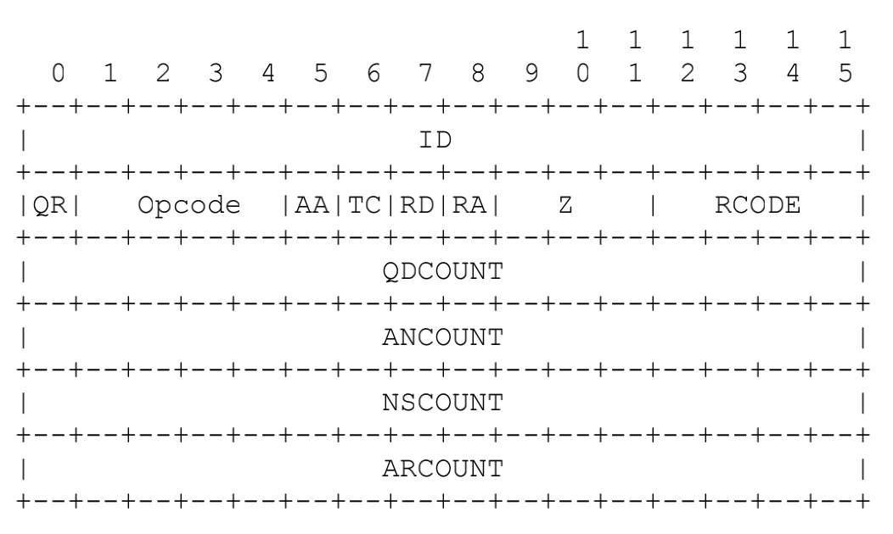

# DNS relayer

[toc]

## 说明

该项目为北邮计算机网络课程设计...目标是实现一个DNS中继器。

---

## 设计


目前的设计如上图。

---

## 目前项目结构及目前实现的功能

```bash
.
├── CMakeLists.txt
├── cache
│   ├── cache.c
│   ├── hash.c
│   └── linkList.c
├── cli.c
├── dnsrelay.txt
├── doc
│   ├── Arg.md
│   ├── Cache.md
│   ├── DNS_message.md
│   └── Thread_pool.md
├── include
│   ├── arg.h
│   ├── cache.h
│   ├── clog.h
│   ├── file_reader.h
│   ├── hash.h
│   ├── linkList.h
│   ├── message.h
│   ├── thread_pool.h
│   └── wrap.h
├── man.txt
├── message
│   └── message.c
├── pool
│   ├── queue.c
│   └── thread_pool.c
├── readme.md
├── relayer.c
├── server.c
├── test
│   └── file_reader_test.c
├── test.c
└── tool
    ├── arg.c
    ├── clog.c
    ├── file_reader.c
    └── wrap.c
```

目前的目录结构如上，其中`cli.c`实现了一个简单的类似于`nslookup`的小工具，可以通过`cli.c`看看如何实现DNS报文编码解码。`server.c`实现了一个DNS中继器（不带缓存，不带本地资源记录），要尝试使用只需要将`server.c`中的如下宏修改为你的`local DNS Server`即可

```c
#define DNS_IP "192.168.43.1"  // 这个ip 是我这的local DNS server的ip 
```


`test.c`和`test`目录下是测试时残留下来的文件。`relayer.c`是一个单纯的中继器，没有中间处理程。`server.c`为该课设的主程序。`dnsrelay.txt`为记录域名及ip的文本文件，`man.txt`需要放到程序执行的同级目录下，否则程序无法正常输出帮助信息。

---

## 各目录实现的内容

`tool`：

- `wrap.c`给一些网络相关的函数包了一层皮，详见:[基于tcp协议的网络程序](https://www.bookstack.cn/read/linux-c/fa2e4c92668c4bb7.md)。
- `arg.c`实现了处理命令行程序的小工具。
- `file_reader.c`实现了从给定的`relayer.txt`中读出指定域名的ipv4地址功能。
- `clog.c`实现了一个轻量级的日志功能。

`message`目录下实现了和DNS报文相关的功能，详见`doc/DNS_message.md`。

`pool`目录实现了一个简单的线程池，详见`doc/Thread_pool.md`。

`cache`目录实现了缓存功能，详见`doc/Cache.md`。

`include`包含各模块功能的接口头文件。

`doc`内为各模块文档。

---

## ~~尚待完成的部分~~

~~目前距离最终版本仍差以下部分~~

- ~~主线程的逻辑实现~~
- ~~处理用户请求线程的逻辑实现~~
- ~~本地资源记录（即在本地的文件中查找资源记录）~~


## 目标

### 基础目标

至少能对用户的A记录查询要求做出响应。

### 感觉较容易实现的额外目标

对用户的CNAME、AAAA、NS记录查询做出响应。


---

## 现在的成果

### 生成可执行文件

示例命令如下：

```bash
git clone git@github.com:XieWeikai/DNS_Relayer.git
mkdir build
cd build
cmake ../DNS_Relayer
make
```

build目录下生成一系列可执行文件，其中`server`为需要的程序。将`man.txt`和`dnsrelay.txt`复制到build目录下，执行如下命令启动DNS中继服务器,其中`dns=...`参数换成你家的本地DNS服务器ip地址。

```bash
./server localfile=dnsrelay.txt dns=192.168.43.1
```

### 目前程序功能

#### 缓存

程序会自动缓存如下类型资源记录方便查找

- A
- NS
- CNAME

其余类型不做缓存，对于一个域名，缓存可以保存多条A记录或多条NS记录。

`cache.c`中实现的缓存功能查找时间复杂度为`O(1)`,基于哈希表和双向链表，该缓存实现是并发安全的。缓存淘汰策略有二：最久不访问的记录淘汰；超过存入缓存时设定的超时时间时淘汰。

#### 文件查找

目前实现了从文本文件中查找A类型资源记录的功能，程序为文件创建了索引，查找复杂度为`O(1)`.若缓存中找不到客户端查询的A类型资源，会从文件中查找，若查到则会将该记录放入缓存，方便下次查找。

#### 中继

若缓存中和文件中都没有记录，程序会像DNS服务器发送请求，并将请求响应回复给客户端，同时将响应中A、NS、CNAME记录送入缓存。


程序自带帮助如下~~（忽略蹩脚英语）~~

```
usage:
    server localfile=filename dns=local_dns_server_ip [options]

    local_dns_server_ip is ip of your Local DNS server.When our program work as a relayer,it will send
    message to the local_dns_server_ip.

    filename is the file that stores a series of domain names and their ipv4 addresses.Each line is in
    the form of: ip domain name.
    e.g.  dnsrelay.txt
    ...
    74.125.207.113 i2.ytimg.com
    74.125.207.113 i3.ytimg.com
    ...

options:
    debug=level
        level can be one of trace,debug,info,warn,error and fatal.Default level is info.

    poolsize=num_of_thread_pool
        Set the size of thread pool. Default size is 10.Size should not be more than 20.


    cachesize=size
        Set the size of cache, Default is 1024. Size should not be more than 2048.

    port=portnumber
        Set the listening port number to portnumber. Default is 53.

    --help
        Show this content.

```

---

## 题外话

程序中出现的英文若有任何错误，请忽视，意会即可......

程序中很多部分的代码因为设想的功能复杂不断改进，中途不免出现很多bug且不断小修小补，导致某些代码繁杂，且还留有debug痕迹......

主程序只是将其余各个部分的功能拼起来并实现程序需求，较为冗长无味。


---

---

---

# 报告

## 需求

本次计算机网络课程设计要求实现一个DNS中继服务器，基本功能为响应用户对A类型的资源记录的请求，并具有拦截功能（即对需要拦截的域名返回无查询结果响应）。

## 程序环境

程序需要在Linux环境下编译运行。

## 最终实现

### 功能

程序实现的功能如下：

- 能响应用户各种类型的DNS请求（A、NS、CNAME会进行缓存，其余类型的请求通过中继来实现）。
- 实现了一个Cache，使用Cache存储A和CNAME和NS类型的资源记录，Cache淘汰策略为:
  - 插入条目时若超过最大条目数则淘汰最久未使用的条目。
  - 插入条目时指定过期时间，超过过期时间的条目被淘汰。
- 采用多线程的方式并发处理请求，为了限制线程数目并节省创建销毁线程的开销，实现了一个简单的线程池。
- 为本地文件（dnsrelay.txt）建立索引，加快本地文件查找速度。
- 实现了一个简洁完善的日志模块。


## 使用方法

设项目目录为`dns`,生成可执行文件步骤如下

1. 进入到`dns`目录所在的目录下，新建目录`build` *（`build`和`dns`同级）*。

2. 执行以下命令,在`build`目录下会产生好几个可执行文件，其中`server`为中继服务器。

   ```bash
   cd build
   cmake ../dns
   make
   ```

3. 执行以下命令启动程序

   ```bash
   ./server --help  # 该命令用于显示简单的帮助信息
   
   # 以下命令启动中继器，localfile参数为为提供的IP域名对照表的文件 dns参数为本地DNS服务器IP地址
   ./server localfile=../dns/dnsrelay.txt dns=192.168.43.1
   
   # 命令行参数可以设置其他一些可选项
   # 如端口(默认53) 日志等级 线程池线程数目 缓存大小
   ```

   

### 效果展示

#### 初步展示

启动中继器

```bash
./server localfile=dnsrelay.txt dns=192.168.43.1 poolsize=100 debug=info port=8080
INFO  Created a threadpool.Size of threadpool:100
INFO  set debug level:info
INFO  Set global socket.listen addr:0.0.0.0:8080
INFO  initiate global cache.size:1024

INFO  initate local file reader:dnsrelay.txt
INFO  set DNS ip:192.168.43.1
INFO  Accepting connections ...
```

使用dig查询www.bilibili.com

```bash
(base) admin@xieweikaideMacBook-Pro design % dig @127.0.0.1 -p 8080 www.bilibili.com

; <<>> DiG 9.10.6 <<>> @127.0.0.1 -p 8080 www.bilibili.com
; (1 server found)
;; global options: +cmd
;; Got answer:
;; ->>HEADER<<- opcode: QUERY, status: NOERROR, id: 38506
;; flags: qr rd ra; QUERY: 1, ANSWER: 9, AUTHORITY: 2, ADDITIONAL: 16

;; QUESTION SECTION:
;www.bilibili.com.		IN	A

;; ANSWER SECTION:
www.bilibili.com.	600	IN	CNAME	a.w.bilicdn1.com.
a.w.bilicdn1.com.	600	IN	A	121.11.192.176
a.w.bilicdn1.com.	600	IN	A	121.11.192.170
a.w.bilicdn1.com.	600	IN	A	121.11.192.168
a.w.bilicdn1.com.	600	IN	A	121.11.192.164
a.w.bilicdn1.com.	600	IN	A	121.11.192.166
a.w.bilicdn1.com.	600	IN	A	121.11.192.172
a.w.bilicdn1.com.	600	IN	A	121.11.192.174
a.w.bilicdn1.com.	600	IN	A	121.11.192.162

;; AUTHORITY SECTION:
bilicdn1.com.		30308	IN	NS	ns4.dnsv5.com.
bilicdn1.com.		30308	IN	NS	ns3.dnsv5.com.

;; ADDITIONAL SECTION:
ns4.dnsv5.com.		168570	IN	A	223.166.151.126
ns4.dnsv5.com.		168570	IN	A	59.36.120.147
ns4.dnsv5.com.		168570	IN	A	101.226.220.12
ns4.dnsv5.com.		168570	IN	A	106.55.82.76
ns4.dnsv5.com.		168570	IN	A	162.14.24.248
ns4.dnsv5.com.		168570	IN	A	162.14.25.248
ns4.dnsv5.com.		168570	IN	A	183.192.164.119
ns3.dnsv5.com.		27621	IN	A	183.192.201.94
ns3.dnsv5.com.		27621	IN	A	223.166.151.16
ns3.dnsv5.com.		27621	IN	A	49.234.175.103
ns3.dnsv5.com.		27621	IN	A	61.151.180.51
ns3.dnsv5.com.		27621	IN	A	162.14.18.188
ns3.dnsv5.com.		27621	IN	A	162.14.24.251
ns3.dnsv5.com.		27621	IN	A	162.14.25.251
ns4.dnsv5.com.		168567	IN	AAAA	2402:4e00:1020:1264:0:9136:29b6:fc32
ns3.dnsv5.com.		45487	IN	AAAA	2402:4e00:1430:1102:0:9136:2b2b:ba61

;; Query time: 66 msec
;; SERVER: 127.0.0.1#8080(127.0.0.1)
;; WHEN: Tue Jul 05 22:27:48 CST 2022
;; MSG SIZE  rcvd: 511

(base) admin@xieweikaideMacBook-Pro design % dig @127.0.0.1 -p 8080 www.bilibili.com

; <<>> DiG 9.10.6 <<>> @127.0.0.1 -p 8080 www.bilibili.com
; (1 server found)
;; global options: +cmd
;; Got answer:
;; ->>HEADER<<- opcode: QUERY, status: NOERROR, id: 46901
;; flags: qr rd ra ad; QUERY: 1, ANSWER: 9, AUTHORITY: 0, ADDITIONAL: 0

;; QUESTION SECTION:
;www.bilibili.com.		IN	A

;; ANSWER SECTION:
www.bilibili.com.	594	IN	CNAME	a.w.bilicdn1.com.
a.w.bilicdn1.com.	594	IN	A	121.11.192.176
a.w.bilicdn1.com.	594	IN	A	121.11.192.170
a.w.bilicdn1.com.	594	IN	A	121.11.192.168
a.w.bilicdn1.com.	594	IN	A	121.11.192.164
a.w.bilicdn1.com.	594	IN	A	121.11.192.166
a.w.bilicdn1.com.	594	IN	A	121.11.192.172
a.w.bilicdn1.com.	594	IN	A	121.11.192.174
a.w.bilicdn1.com.	594	IN	A	121.11.192.162

;; Query time: 0 msec
;; SERVER: 127.0.0.1#8080(127.0.0.1)
;; WHEN: Tue Jul 05 22:27:54 CST 2022
;; MSG SIZE  rcvd: 189
```

上面为终端操作结果，可以看到进行了两次同样的请求，中继器输出如下

```bash
INFO  received from 127.0.0.1 at PORT 57320
INFO  request for:www.bilibili.com type:A
INFO  send message to Local DNS server and wait for response
INFO  reply with the message from local DNS server

INFO  received from 127.0.0.1 at PORT 63399
INFO  request for:www.bilibili.com type:A
INFO  get CNAME and A resource record in cache and respon to client !
```

可以看到，第一次请求花费了66ms,由中继器的输出可以看到中继器向本地DNS服务器发送请求，收到回复后响应。而第二次请求花费了0ms,从中继器的输出可以看到程序从缓存中取出了响应的资源记录。可以观察到资源记录的TTL在变化，中继器的缓存会根据本地DNS服务器回复中的TTL设置TTL,并且根据时间改变TTL,到期后将从缓存中删去对应记录。

#### 从本地文件中查询

在`dnsrelay.txt`中有如下记录(随便选取的)

```bash
210.242.125.98 base5.googlehosted.com
```

尝试查找该记录

```bash
; <<>> DiG 9.10.6 <<>> @127.0.0.1 -p 8080 base5.googlehosted.com
; (1 server found)
;; global options: +cmd
;; Got answer:
;; ->>HEADER<<- opcode: QUERY, status: NOERROR, id: 27472
;; flags: qr rd ra ad; QUERY: 1, ANSWER: 1, AUTHORITY: 0, ADDITIONAL: 0

;; QUESTION SECTION:
;base5.googlehosted.com.		IN	A

;; ANSWER SECTION:
base5.googlehosted.com.	600000	IN	A	210.242.125.98

;; Query time: 0 msec
;; SERVER: 127.0.0.1#8080(127.0.0.1)
;; WHEN: Tue Jul 05 22:38:03 CST 2022
;; MSG SIZE  rcvd: 56

(base) admin@xieweikaideMacBook-Pro design % dig @127.0.0.1 -p 8080 base5.googlehosted.com

; <<>> DiG 9.10.6 <<>> @127.0.0.1 -p 8080 base5.googlehosted.com
; (1 server found)
;; global options: +cmd
;; Got answer:
;; ->>HEADER<<- opcode: QUERY, status: NOERROR, id: 42903
;; flags: qr rd ra ad; QUERY: 1, ANSWER: 1, AUTHORITY: 0, ADDITIONAL: 0

;; QUESTION SECTION:
;base5.googlehosted.com.		IN	A

;; ANSWER SECTION:
base5.googlehosted.com.	599980	IN	A	210.242.125.98

;; Query time: 0 msec
;; SERVER: 127.0.0.1#8080(127.0.0.1)
;; WHEN: Tue Jul 05 22:38:23 CST 2022
;; MSG SIZE  rcvd: 56
```

可以看到程序正确的返回了结果，用时0ms。考虑到本地存有的IP地址一般长时间不会改变，因此将其TTL设置为了600000，上面同样进行了两次请求，观察中继器输出如下

```bash
INFO  received from 127.0.0.1 at PORT 56577
INFO  request for:base5.googlehosted.com type:A
INFO  get A resource record from local file and respon to client !
INFO  name:base5.googlehosted.com ip:210.242.125.98

INFO  received from 127.0.0.1 at PORT 55676
INFO  request for:base5.googlehosted.com type:A
INFO  get resource record in cache and respon to client !
```

可以看到第一次请求，程序从文件中读出了IP并做出响应，第二次请求程序从缓存中取出了相应的资源记录并做出响应。

#### 屏蔽域名

在dnsrelay.txt中有如下记录(随机挑选)

```bash
0.0.0.0 abcdesign.ru
0.0.0.0 ad.qingyule.com
```

尝试请求如上两个IP,结果如下

```bash
(base) admin@xieweikaideMacBook-Pro design % dig @127.0.0.1 -p 8080 abcdesign.ru

; <<>> DiG 9.10.6 <<>> @127.0.0.1 -p 8080 abcdesign.ru
; (1 server found)
;; global options: +cmd
;; Got answer:
;; ->>HEADER<<- opcode: QUERY, status: NXDOMAIN, id: 2282
;; flags: qr rd ra ad; QUERY: 1, ANSWER: 0, AUTHORITY: 0, ADDITIONAL: 0

;; QUESTION SECTION:
;abcdesign.ru.			IN	A

;; Query time: 0 msec
;; SERVER: 127.0.0.1#8080(127.0.0.1)
;; WHEN: Tue Jul 05 22:44:27 CST 2022
;; MSG SIZE  rcvd: 30

(base) admin@xieweikaideMacBook-Pro design % dig @127.0.0.1 -p 8080 ad.qingyule.com

; <<>> DiG 9.10.6 <<>> @127.0.0.1 -p 8080 ad.qingyule.com
; (1 server found)
;; global options: +cmd
;; Got answer:
;; ->>HEADER<<- opcode: QUERY, status: NXDOMAIN, id: 37568
;; flags: qr rd ra ad; QUERY: 1, ANSWER: 0, AUTHORITY: 0, ADDITIONAL: 0

;; QUESTION SECTION:
;ad.qingyule.com.		IN	A

;; Query time: 0 msec
;; SERVER: 127.0.0.1#8080(127.0.0.1)
;; WHEN: Tue Jul 05 22:45:18 CST 2022
;; MSG SIZE  rcvd: 33
```

可以看到status为NXDOMAIN，即没有查询到该域名，中继器正确的屏蔽了域名。

#### 其余类型的查询

中继器的实现可以正确处理各种请求，其中A、NS、CNAME类型的资源记录程序在通过查询本地文件、向本地DNS服务器查询后会缓存到Cache中，这三类以外的请求将直接采用中继的办法给客户端回复。

现展示几个例子如下：

```bash
(base) admin@xieweikaideMacBook-Pro design % dig @127.0.0.1 -p 8080 baidu.com NS

; <<>> DiG 9.10.6 <<>> @127.0.0.1 -p 8080 baidu.com NS
; (1 server found)
;; global options: +cmd
;; Got answer:
;; ->>HEADER<<- opcode: QUERY, status: NOERROR, id: 34438
;; flags: qr rd ra ad; QUERY: 1, ANSWER: 5, AUTHORITY: 0, ADDITIONAL: 0

;; QUESTION SECTION:
;baidu.com.			IN	NS

;; ANSWER SECTION:
baidu.com.		86394	IN	NS	ns4.baidu.com.
baidu.com.		86394	IN	NS	ns3.baidu.com.
baidu.com.		86394	IN	NS	ns2.baidu.com.
baidu.com.		86394	IN	NS	dns.baidu.com.
baidu.com.		86394	IN	NS	ns7.baidu.com.

;; Query time: 0 msec
;; SERVER: 127.0.0.1#8080(127.0.0.1)
;; WHEN: Tue Jul 05 22:52:11 CST 2022
;; MSG SIZE  rcvd: 117

(base) admin@xieweikaideMacBook-Pro design % dig @127.0.0.1 -p 8080 www.baidu.com CNAME

; <<>> DiG 9.10.6 <<>> @127.0.0.1 -p 8080 www.baidu.com CNAME
; (1 server found)
;; global options: +cmd
;; Got answer:
;; ->>HEADER<<- opcode: QUERY, status: NOERROR, id: 8419
;; flags: qr rd ra ad; QUERY: 1, ANSWER: 1, AUTHORITY: 0, ADDITIONAL: 0

;; QUESTION SECTION:
;www.baidu.com.			IN	CNAME

;; ANSWER SECTION:
www.baidu.com.		592	IN	CNAME	www.a.shifen.com.

;; Query time: 0 msec
;; SERVER: 127.0.0.1#8080(127.0.0.1)
;; WHEN: Tue Jul 05 22:51:55 CST 2022
;; MSG SIZE  rcvd: 58

(base) admin@xieweikaideMacBook-Pro design % dig @127.0.0.1 -p 8080 www.zhihu.com AAAA

; <<>> DiG 9.10.6 <<>> @127.0.0.1 -p 8080 www.zhihu.com AAAA
; (1 server found)
;; global options: +cmd
;; Got answer:
;; ->>HEADER<<- opcode: QUERY, status: NOERROR, id: 38117
;; flags: qr rd ra; QUERY: 1, ANSWER: 11, AUTHORITY: 1, ADDITIONAL: 0

;; QUESTION SECTION:
;www.zhihu.com.			IN	AAAA

;; ANSWER SECTION:
www.zhihu.com.		600	IN	CNAME	www.zhihu.com.ipv6.dsa.dnsv1.com.
www.zhihu.com.ipv6.dsa.dnsv1.com. 600 IN CNAME	1595096.sched.d0-dk.tdnsdp1.cn.
1595096.sched.d0-dk.tdnsdp1.cn.	600 IN	AAAA	240e:914:2002:0:134::
1595096.sched.d0-dk.tdnsdp1.cn.	600 IN	AAAA	240e:c3:2c00:304:6c::a
1595096.sched.d0-dk.tdnsdp1.cn.	600 IN	AAAA	240e:a5:4900:3:1001::
1595096.sched.d0-dk.tdnsdp1.cn.	600 IN	AAAA	240e:965:802:c01:6c::5
1595096.sched.d0-dk.tdnsdp1.cn.	600 IN	AAAA	240e:965:802:c01:6c::9
1595096.sched.d0-dk.tdnsdp1.cn.	600 IN	AAAA	240e:97c:34:301:35::
1595096.sched.d0-dk.tdnsdp1.cn.	600 IN	AAAA	240e:950:2:9a:6c::4
1595096.sched.d0-dk.tdnsdp1.cn.	600 IN	AAAA	240e:914:2002:0:133::
1595096.sched.d0-dk.tdnsdp1.cn.	600 IN	AAAA	240e:a5:4900:3:1002::

;; AUTHORITY SECTION:
d0-dk.tdnsdp1.cn.	15	IN	NS	ns1.dp1.tdnsdp1.cn.

;; Query time: 49 msec
;; SERVER: 127.0.0.1#8080(127.0.0.1)
;; WHEN: Tue Jul 05 22:53:53 CST 2022
;; MSG SIZE  rcvd: 392
```

## 设计

### 总体设计

DNS的总体设计如下图描述


中继器接收到用户的请求后将单独将处理该请求的任务放入线程池中，空闲的线程将会接收任务。线程首先尝试从缓存中查找请求的资源记录，若未查到则在本地文件中查找，仍未查到则向本地DNS服务器发送请求查询相关资源记录。找到资源记录后向客户端做出响应，最近使用的资源记录都会被存放在缓存中以增加下一次相同请求的回应速度。

程序需要实现的功能有：

- 对DNS报文的处理功能，如构造报文、解析报文。
- 实现一个线程池。
- 实现从本地文件中查询A类型资源记录。
- 实现一个并发安全的缓存。
- 日志功能。
- 命令行参数的处理。

项目的目录结构如下:

```bash
.
├── cache
│   ├── cache.c
│   ├── hash.c
│   └── linkList.c
├── doc
│   ├── img
│   ├── Arg.md
│   ├── Cache.md
│   ├── DNS_message.md
│   └── Thread_pool.md
├── include
│   ├── arg.h
│   ├── cache.h
│   ├── clog.h
│   ├── file_reader.h
│   ├── hash.h
│   ├── linkList.h
│   ├── message.h
│   ├── thread_pool.h
│   └── wrap.h
├── message
│   └── message.c
├── pool
│   ├── queue.c
│   └── thread_pool.c
├── test
│   ├── file_reader_test.c
│   └── test.c
├── tool
│   ├── arg.c
│   ├── clog.c
│   ├── file_reader.c
│   └── wrap.c
├── CMakeLists.txt
├── cli.c
├── dns_test.py
├── dns_test_compare.sh
├── dnsrelay.txt
├── man.txt
├── readme.md
├── relayer.c
└── server.c
```

`cache`目录下实现了一个并发安全的缓存，该缓存由哈希表和双向链表构成；`message`目录下实现了DNS报文的构造和解析功能；`pool`目录下实现了一个简单的线程池；`tool`目录下放了一些工具，如日志、命令行参数解析、读取本地文件、包装socket相关函数；`include`文件夹下为所有的头文件；`doc`目录下为一些模块的使用文档。`CMakeLists.txt`是`cmake`编译工具需要的文件；`cli.c`为测试`message.c`功能时编写的类似`dig`的客户端程序；`relayer.c`为单纯的中继器，无其他功能；`server.c`即本次课程设计实现的中继器程序；`dns_test.py`和`dns_test_compare.sh`是进行测试用的。在后面的部分将注意对各个部分做出说明。

### 报文解析和构造

#### 结构设计

*(报文解析和构造相关的源码见`message/message.c`和`include/message.h`)*

报文头部格式如下（摘自RFC1035）



紧接着头部的则是question段、authority段和additional段，依据该结构定义了DNS报文的结构体，如下为结构体以及相关的宏

```c
#define MAX_SIZE 32

// RR section
#define ANSWER 0
#define AUTHORITY 1
#define ADDITIONAL 2

// message 结构
typedef struct msg{
    uint16_t ID;  // 对应头部ID字段
    uint16_t flag;  // 对应QR Opcode AA TC RD RA Z RCODE
    uint16_t q_count; // QDCOUNT
    uint16_t RR_count[3]; // RR_count[ANSWER]代表answer段数量 以此类推

    question *ques[MAX_SIZE]; // question段
    RR *resourse_record[3][MAX_SIZE]; // resourse_record[ANSWER]代表answer段，以此类推
}message;
```

question段对应的格式如下图


依据该格式定义相应结构体question以及相关的宏定义如下

```c
#define MAX_LEN 256

//type value
#define A 1
#define NS 2 //an authoritative name server
#define CNAME 5 //the canonical name for an alias
#define PTR 12 // a domain name pointer
#define AAAA 28

//class value
#define IN 1 //the Internet
#define CS 2 // the CSNET class (Obsolete - used only for examples in some obsolete RFCs)
#define CH 3 // the CHAOS class
#define HS 4 // Hesiod [Dyer 87]

// question对应的结构
typedef struct ques{
    char q_name[MAX_LEN];
    uint16_t q_type;
    uint16_t q_class;
}question;
```

Resourse record段对应的格式如下图所示


依据以上格式，定义相关结构体和如下

```c
// data type
#define STRING_TYPE 0
#define BINARY_TYPE 1

// resource record 对应的结构
typedef struct {
    char name[MAX_LEN]; 
    uint16_t type;      
    uint16_t class;
    uint32_t TTL;
  
    uint16_t data_length;
    void *data;
  // 若type为CNAME或NS这类字符串类数据的，则data_type为STRING_DATA
  // 否则data_type为BINARY_TYPE
  // 若为STRING_DATA则字符串数据放入string_data内，data_length字段不使用
  // 若为BINARY_DATA则数据放入data指向的内存中，string_data不使用
  // 构造报文时会依据data_type来填充RDATA和RDLENGTH
    uint8_t data_type; 
    char string_data[MAX_LEN];
}RR;
```

有了报文相关的定义后，在源码中实现了两个重要的函数来实现报文的构造和解析

```c
//将msg结构编码为可以实际发送的报文
//注意给够buff的长度
//否则会段错误，这里为了方便默认buff长度足够
//返回报文的长度(以字节为单位) 出错则返回-1
ssize_t encode(message *msg,void *buff);

//将报文buff变为结构体
//buff内为DNS报文
//若报文正确无误，则会构造对应的message结构并返回指向构造好的结构的指针
message *decode(void *buff);
```

其中`encode`函数用于将`message`结构体变为实际可发送的DNS报文，该函数会将结构体中各个字段以符合DNS报文格式的方式填入buff中，对于question中的name、resource record中的name、RDATA中的字符串数据，该函数可以按照RFC中的规定进行压缩(使用了一个哈希表记录已经填入的各个字符串的位置信息)。`decode`函数则将一个DNS报文转换为`message`类型的结构体。

#### 使用方法

##### 构造报文

创建和销毁报文的函数声明如下

```c
// 创建新报文
// 即初始化一个message结构并返回
// 无内容
message *newMsg();

//释放一条message结构占用的空间
//对任意的message结构，使用完后都应该用此函数示范所有占用的空间
void destroyMsg(message *msg);
```

设置报文是请求报文或响应报文使用如下函数

```c
//设置报文为请求报文
void setQuery(message *msg);

//设置报文为响应报文
void setResp(message *msg);

// 下面是例子
setQuery(msg); // 将msg报文设为请求报文
setResp(msg);  // 将msg报文设为响应报文
```

设置报头中的opcode相关函数和宏如下(基本上都是设为QUERY的，其他的课程设计也用不到)

```c
//opcode
#define QUERY 0 //a standard query (QUERY)
#define IQUERY 1  //an inverse query (IQUERY)
#define STATUS 2  //a server status request (STATUS)

//设置操作码
void setOpcode(message *msg,uint16_t op);

// 示例 设置请求为标准请求
setOpcode(msg,QUERY);
```

设置其他一些标志位的相关函数和宏如下

```c
// flag
#define AA 10 //Authoritative Answer
#define TC 9 //TrunCation
#define RD 8 // Recursion Desired
#define RA 7 //Recursion Available
#define AD 5 //1 为应答服务器已经验证了该查询相关的 DNSSEC 数字签名 (RFC1035中没有)抓包看到的，网上查到的
#define CD 4 //1 为服务器并未进行相关 DNSSEC 数字签名的验证       (RFC1035中没有)抓包看到的，网上查到的

//设置某个标志位
//如要设置AA位，则这样调用  setFlag(msg,AA)
//相应的宏已经预先写好 包括 AA TC RD RA AD CD
void setFlag(message *msg,uint16_t b);
```

设置响应码`RCODE`的相关函数和宏如下

```c
//Rcode
#define NO_ERR 0 // no error
#define FMT_ERR 1 //Format error - The name server wasunable to interpret the query.
#define SERVER_FAILURE 2  //Server failure - The name server was unable to process this query due to a problem with the name server.
#define NAME_ERR 3 //domain name referenced in the query does not exist.

//设置响应码
void setRCODE(message *msg,uint16_t rcode);

// 示例 设置响应
setRCODE(msg,NAME_ERR); // 查无此名
```

以上就是构造报头相关的函数和宏，报头中的`QDCOUNT`、`ANCOUNT`、`NSCOUNT`、`ARCOUNT`不需要自己设置，在添加相关字段时会自动设置。

除了设置报文头部相关字段，该模块还实现了设置question、answer、authority、additional段的函数。

设置qustion中字段的方式如下

```c
//type value
#define A 1
#define NS 2 //an authoritative name server
#define CNAME 5 //the canonical name for an alias
#define AAAA 28
// 以上是目前支持的资源类型

//class value
#define IN 1 //the Internet
#define CS 2 // the CSNET class (Obsolete - used only for examples in some obsolete RFCs)
#define CH 3 // the CHAOS class
#define HS 4 // Hesiod [Dyer 87]

//设置QNAME
void setQNAME(question *q,char *name);

// 示例 构建请求www.baidu.com A类型资源的question
question q;
setQNAME(&q,"www.baidu.com");
q.q_type = A ; // A类型请求
q.q_class = IN; //一般来说都是IN 其他类型不会碰到的
```

设置好question后，将该question添加到message中的方法如下

```c
//为报文添加一个问题
//失败返回0
int addQuestion(message *msg,question *q);

// 示例 
message *msg = newMsg();
...  //构造msg的首部
question q;
...  // 设置q的内容
addQuestion(msg,&q);// 将该问题添加到msg报文中
```

除了对question的处理，该模块还能对resource record进行处理，设置resource record的方法如下

```c
//设置RR的name字段
void setRRName(RR *rr,char *s);

//设置RR的data字段为字符串
//如CNAME、NS之类的记录用该函数设置
void setRRNameData(RR *rr,char *name);

//设置RR的data字段 二进制数据
void setRRData(RR *rr,void *data,size_t size);
// name和data一定要用上面几个函数设置，千万不要直接修改结构体成员

// 其余的字段type class TTL 直接赋值即可 如
RR r;
r.type = CNAME;
r.class = IN;
r.TTL = 4000;
```

向message中添加resourse record的方法如下

```c
// RR section
#define ANSWER 0
#define AUTHORITY 1
#define ADDITIONAL 2

// 添加一条资源记录
// 可以选择添加到 ANSWER AUTHORITY ADDITIONAL中的一段，由第三个参数标识
// 如可以这样用 addRR(msg,q,ANSWER)
int addRR(message *msg,RR *q,int type);

// 示例：向answer section 添加一条RR
message *msg = newMsg();
...//构造msg其他字段
RR r;
r.type = CNAME;
r.class = IN;
r.TTL = 4000;
setRRName(&r,"www.baidu.com");
setRRNameData(&r,"shifen.hahalala.wawa.ii");
addRR(msg,&r,ANSWER);
```

使用上述介绍的函数设置好message结构后，可以使用如下函数将message变为实际可发送的报文

```c
//将msg结构编码为可以实际发送的报文
//注意给够buff的长度
//否则会段错误，这里为了方便默认buff长度足够
//返回报文的长度 出错则返回-1
ssize_t encode(message *msg,void *buff);

//示例
char buff[1024];
ssize_t n;
message *msg = newMsg();
... // 设置msg中各个部分内容
n = encode(msg,buff);  // 若函数成功执行，则buff中即为可发送的DNS报文 n为报文长度
```

##### 解析报文

接收到一个DNS报文后，将其解析为message结构的方法如下

```c
//将收到的报文buff变为结构体
message *decode(void *buff);

char buff[1024];
... // 接收DNS报文，装在buff中
message *msg = decode(buff);  // 创建一个message结构，解析buff，填写好各个字段并返回指向message的指针
```

### 线程池

*（线程池部分源码见`thread_pool.c`、`queue.c`和`include/thread_pool.h`）*

在我们的代码实现中，通过多线程的方式来实现并发的处理用户请求。对于每一个用户请求，我们会使用一个线程去处理。但是如果采用每接收到一个请求就开启一个线程进行处理的方式，会有一些缺点

- 每次请求到来时创建线程，处理完请求销毁线程，频繁的创建、销毁工作费时且无意义。
- 无法控制线程的数量，若短时间内有过多的请求到来，会创建非常多的线程，占用很多系统资源。

为了解决以上的问题，我们实现了一个线程池。在程序启动时创建固定数量的若干常驻线程，每当有用户请求到来时则将处理用户请求这一任务放入任务队列中，空闲的线程将从队列取出任务并执行。

#### 并发安全的阻塞队列

为了实现线程池，首先要有一个可以由多个线程同时操作的队列，并且该队列为空时出队操作会发生阻塞。该队列将作为线程池的任务队列来使用。


上图为`SafeQueue`的结构表示，其中`head`指向链表的头结点(头结点无有效数据，仅为了方便处理)，`tail`指向链表尾部，链表尾部即为队尾，头结点的写一个节点即为队头。`q_lock`为保护该队列结构的锁，`q_ready`为条件变量，指示队列不为空，可以执行出队操作。`destroyed`标志该队列是否仍在使用中，若该队列已经关闭，则会释放部分资源，将`destroyed`置1，接下来的所有入队操作不做任何事，出队操作直接返回`NULL`。

该队列相关结构定义如下:

```c
typedef struct queue_node{
    void *data;  // data指向任意数据，故数据类型由使用队列的用户决定，data的分配和释放由用户处理
    struct queue_node *next;   // 后继指针
}QueNode;

typedef struct safeque{
    QueNode *head,*tail; // 头尾
    pthread_mutex_t q_lock; // 保护队列的锁
    pthread_cond_t q_ready; // 条件变量，用于队列空时阻塞出队操作
    int destroyed;    // 队列是否仍在使用的标志
}SafeQueue;
```

与该队列相关的操作封装为如下函数:

```c
// 一个并发安全的队列
typedef struct safeque *safequeue;

// 新建队列
safequeue NewSafeQueue();

// 入队
void SafeEnque(safequeue q, void *data);

// 出队
void *SafeDeque(safequeue q);

// 关闭该队列
// 释放一部分资源
// 关闭后依旧可以进行SafeEnque SafeDeque
// 但不会有任何效果
void SafeClose(safequeue q);

// 销毁队列，彻底释放掉该队列的全部占用资源
// 此后不得再对该队列有任何操作
// 否则会操作错误的内存
void SafeDestroy(safequeue q);
```

#### 线程池实现


上图为线程池逻辑描述，左边的`worker`即为一系列常驻的线程，在创建线程池时被启动，负责从任务队列取出任务并执行。右边的任务队列使用上一小节描述的并发安全的阻塞队列来实现，其中一个任务可以看出是一个待执行函数及其对应的参数，故任务定义如下:

```c
typedef struct task{
    void (*func)(void *); // 待执行的函数
    void *arg; // 参数列表
}Task;
```

`worker`只需要取出任务并执行，实现简单，定义如下：

```c
// 消费者 负责接收任务并执行
static void *worker(void *data){
    safequeue taskQue = data;
    Task *t;
    while((t = SafeDeque(taskQue)) != NULL){ // 若出队返回NULL则说明该队列被关闭了
        t->func(t->arg);
        free(t);
    }
    return NULL;
}
```

由以上描述可知线程池由一系列常驻的`worker`和任务队列组成，定义`ThreadPool`如下:

```c
typedef struct threadpool{
    safequeue q;   // 任务队列
    pthread_t *ids; // 线程id 即worker的线程id 一共有num个worker
    int num; // 线程数
}ThreadPool;
```

以上便是对线程池设计实现的简要描述。

#### 线程池的使用

线程池对外仅简单暴露如下几个接口

```c
// 线程池指针
typedef struct threadpool *Pool;

// 创建一个有num个线程的线程池
Pool CreateThreadPool(int num);

// 添加一个任务交给线程池来做
// func为要执行的函数
// data为要传给func的参数
void AddTask(Pool pool,void (*func)(void *),void *data);

// 关闭线程池
void ClosePool(Pool pool);
```

一个简单的示例如下

```c
#include <stdio.h>
#include <unistd.h>

#include "thread_pool.h"

void func1(void *data){
    for(int i=0;i<5;i++) {
        printf("func1 !!!\n");
        sleep(1);
    }
}

void func2(void *data){
    for(int i=0;i<5;i++) {
        printf("func2 !!!\n");
        sleep(1);
    }
}

void func3(void *data){
    for(int i=0;i<3;i++) {
        printf("func3 !!!\n");
        sleep(1);
    }
}

int main(){
    Pool p = CreateThreadPool(2); // 两个线程的线程池
    AddTask(p,func1,NULL);
    AddTask(p,func2,NULL);
    AddTask(p,func3,NULL);

    // ClosePool会清除任务队列，等待已有线程执行完现在的任务后退出
    //此处防止ClosePool清理调放入的任务
    sleep(8); 
  
    ClosePool(p);
    return 0;
}
```

输出如下

```bash
func2 !!!
func1 !!!
func1 !!!
func2 !!!
func1 !!!
func2 !!!
func2 !!!
func1 !!!
func2 !!!
func1 !!!
func3 !!!
func3 !!!
func3 !!!
```

可以看到`func3`等到了最后才执行，这是因为线程池中只有两个线程，得先执行完一个任务才能空出线程池接着执行`func3`。

---

### 缓存

*（该部分代码见`cache/hash.c`、`cache/linkList.c`、`cache/cache.c`、`include/hash.h`、`include/linkList.h`、`cache/cache.h`）*

为了提高查询速度，DNS中继器中实现了一个缓存，该缓存中会存有最近从本地文件中查到的资源记录或从本地DNS服务器中得到的资源记录，以提高程序效率。该缓存的淘汰策略为

- 添加缓存条目时若缓存中条目数已经达到最大，则淘汰缓存中最久未使用的条目并替换(与LRU策略一致)。
- 插入条目时设置TTL,若查找该条目时发现已经过期，则删去该条目，返回无查询结果。

为了实现以上功能的缓存，需要有哈希表、双向链表作为基本组件。

#### 双向链表

由于使用LRU淘汰策略，需要有相关数据结构维护各个缓存条目近期是否使用情况的信息。用双向链表来实现这种信息的维护是很好的选择。缓存条目最近使用的信息将由该条目在链表中的顺序体现，从链表头到链表尾即为最近使用到最久未使用的条目。双向链表的好处在于能很方便的取出一个节点，并将其插入链表中的某个位置。故采用这种结构，淘汰缓存条目时从链表尾部淘汰即可，插入新条目放入链表头部即可，查询条目时将对应条目节点移动至链表头即可。


双向链表结构如上图所示，为了简化代码，设置了头结点和尾节点(因为都不使用，故头尾节点都用同一个节点)。双向链表相关结构定义如下:

```c
// 链表节点定义
typedef struct linknode{
    void *data; // 数据
    struct linknode *pre,*next; // 前驱、后继指针
}linkNode;

// 双向链表
typedef struct link{
    linkNode *head,*tail; //头结点尾节点都不使用
}LinkList;
```

依据以上的定义，在代码中我们实现了将节点从链表中取出、将节点插入表头、将节点插入表尾、从表头表尾取出节点等等操作。

#### 哈希表

双向链表便于维护缓存条目最近是否使用过的信息，但查找速度不佳，若单独只使用双向链表来作为缓存，则查找时只能从头遍历整个链表，时间复杂度为`O(n)`。为了提高查找速度，考虑使用哈希表来进行查找。


上图为代码中实现的哈希表对应的结构，其具体定义如下，哈希表的key为字符串，data由用户决定，在表内只保存指向实际数据的指针。

```c
typedef struct node{
    char name[HASH_KEY_MAX_LEN+1]; //键
    void *data;         //值
    struct node *next;  //防冲突
}Node;

typedef struct {
    Node **h; //表
    unsigned int len; // h的长度 可变
    unsigned int num; // 表中元素个数
}HashTab;
```

该结构使用了链地址法来解决hash碰撞问题。对于空间大小固定的哈希表，容易发现以下问题

- 当放入哈希表中元素过多、h长度过少时，冲突太多，导致h中每一条链长度过长，链式查找速度慢。
- 若哈希表中元素较少，h长度过大，则空间利用效率低，浪费了内存。

故在我们的代码实现中，哈希表中h的长度是可变的，当num>=2 * len时，会将h的长度放大为原来的两倍；当num * 2 < len时，会将h长度变为原来的二分之一。

利用以上定义的结构，在代码中我们将哈希表相关的操作如插入、查找、删除操作进行了封装，可以直接供使用者调用。

#### 并发安全的cache

通过结合上两节描述的双向链表和哈希表，外加使用锁即可实现一个并发安全的cache，缓存的粗略结构(不完整，但描述了主要思想)如下图所示


如上图，哈希表的`data`部分为一个指向双向链表节点的指针，双向链表的`data`部分为一个指向图中黄色结构(省略了部分字段)的指针，其中记录着该缓存条目的TTL(单位:s)和save time(时间戳，存入该条目的时间),这两个字段用于判断一次查找时查到的条目是否已过期。图中黄色部分结构内的`data`为指向使用用户存入的数据的指针。

与该缓存相关的操作执行逻辑为：

- `CachePut` 向缓存中放入条目
  - 若该`key`对应条目在缓存中已存在，则更新`data`并将对应双向链表节点移动到表头。
  - 若该`key`对应条目不存在
    - 缓存中条目数未达到最大值则创建新的节点，放入双向链表表头，在哈希表插入对应项。
    - 条目数达到最大，则从双向链表表尾删去节点，从哈希表删去相应项，接着进行上一条描述的操作。
- `CacheGet` 从缓存中查找对应的条目
  - 若`key`在哈希表中查找无果则返回`NULL`。
  - 若`key`在哈希表中查找到项
    - 若当前时间戳大于sava time + TTL则从链表和哈希表删除该条目，返回`NULL`。
    - 若条目没过期则将对应链表节点移动到表头，返回`data`。


源代码中定义的相关结构体如下：

```c
typedef struct cache {
    HashTab *hTab;   // 哈希表 哈希表中存的是指向双向链表节点的指针
    LinkList *lList; // 双向链表
    int len; // 已经存入的个数
    int maxSize; // 最大缓存个数
    pthread_rwlock_t mux; // 多读单写锁  在一些不改变结构的操作时用读锁 改变结构的操作用写锁

  // 设计该模块时，初衷是希望使用者可以任意的存入自定义的数据而不受限制
  // 其中CachePut函数原型为
  // void CachePut(Cache *c, char *key, void *data, size_t size, time_t TTL);
  // c为该缓存结构，key为键data为使用者自定义数据的地址，size为数据大小，TTL为该缓存保存时间
  // 在内部存入用户的数据时，会将用户的数据整个复制一份存下来，考虑到使用者存入的数据内有可能会有指针这类
  // 指向别处数据的字段，为了能正确复制使用者的数据，将复制的操作交由使用者来决定
  // 使用者可以在初始化时指定copy函数，如若不指定该函数，则默认的复制操作为从data开始复制size大小的内存空间
    void *(*copy)(void *data); // 复制函数，用于复制一份要存入的数据
  
  // 与上面的copy同理，在需要丢弃一些缓存条目时，丢弃的操作可以由使用者自行规定
  // 若不指定delete,默认的行为等同于free(data)
    void (*delete)(void *data); // 销毁函数，用于销毁一份存入的数据
  
  // 以上两个函数需要有
} Cache;
```

```c
// 双向链表里存的为该结构
// 该结构即为上面图片中的黄色部分
// 记录着该条目的一些信息，以便进行相关操作时使用
// data指向的即为使用者存入的数据(使用copy复制后的副本)
typedef struct {
    char key[SAVE_UNIT_KEY_MAX_LEN+1];
    time_t saveTime; //存入缓存的时间
    time_t TTL;   // 存活时间
    void *data;  // 数据
    size_t dataSize; // 数据大小
}saveUnit;
```

`Cache`对外提供的接口如下:

```c
// 创建一个最多存放maxSize个条目的缓存
// 传入的copy 和 delete可以为NULL
// 为NULL 则执行默认操作
Cache *CreateCache(int maxSize,void *(*copy)(void *data),void (*delete)(void *data));

// 销毁缓存
void DestroyCache(Cache *c);

// 将一个条目存入缓存中
// c 为先前创建的缓存 key为键 data为指向想要缓存数据的指针 size为要缓存数据的大小
// TTL为该缓存条目存活时间（单位：秒）（这个时间不是指未使用该缓存的时间，而是指put进来之后能存活的时间）
// 若key与之前存放条目相同会覆盖之前的条目
void CachePut(Cache *c, char *key, void *data, size_t size, time_t TTL);

// 从缓存中取出一条数据
// c 为缓存 key为键
// 返回指向数据的指针
// 注意返回的指针指向的空间要由使用者自行释放！！！！
//（为了防止并发操作带来的冲突 所以返回的数据是额外拷贝的一份 交由使用者管理 故需要使用者释放）
void *CacheGet(Cache *c, char *key);
```

### 本地文件读取

*（该部分代码见 `tool/file_reader.c`、`include/file_reader.h`）*

本模块的目的是实现对本地配置文件的快速读取.

对外接口如下:

```c
struct file_reader *file_reader_alloc(const char *file_name);

void file_reader_free(struct file_reader *fr);

char *file_reader_get_a_record(struct file_reader *fr, char *domain, char *ip);
```

其中 `file_reader_get_a_record` 函数实现了通过域名查询 IP 的功能.

具体实现是建立了域名-本地文件记录位置的索引, 也就是:

```c
struct file_reader {
    FILE *fd;
    HashTab *item_index;
};
```

建立索引的过程如下:

```c
static void file_reader_indexing(struct file_reader *fr) {
    char ip[16], domain[512];
    long cur;
    fseek(fr->fd, 0, SEEK_SET);
    while(cur = ftell(fr->fd), fscanf(fr->fd, "%s %s", ip, domain) != EOF) {
        insert(fr->item_index, domain, &cur, sizeof(cur));
    }
}
```

读取时通过哈希表获取该条记录位置并读出, 若该条记录不匹配则重新索引文件, 若匹配则返回 IP:

```c
char *file_reader_get_a_record(struct file_reader *fr, char *domain, char *ip) {
    long *pcur = search(fr->item_index, domain);
    if (pcur == NULL) {
        return NULL;
    }

    char tdomain[512];
    fseek(fr->fd, *pcur, SEEK_SET);
    fscanf(fr->fd, "%s %s", ip, tdomain);

    if (strcmp(domain, tdomain) != 0) {
        file_reader_indexing(fr);
        return NULL;
    }

    return ip;
}
```

### 日志

*（该部分代码见 `tool/clog.c`、`include/clog.h`）*

该模块主要目的是提供简易, 可控的日志输出, 提供按等级屏蔽日志等功能.

对外提供了 7 个日志宏:

```c
#define log_trace(...) clog_log(CLOG_LEVEL_TRACE, __VA_ARGS__)
#define log_debug(...) clog_log(CLOG_LEVEL_DEBUG, __VA_ARGS__)
#define log_info(...)  clog_log(CLOG_LEVEL_INFO, __VA_ARGS__)
#define log_warn(...)  clog_log(CLOG_LEVEL_WARN, __VA_ARGS__)
#define log_error(...) clog_log(CLOG_LEVEL_ERROR, __VA_ARGS__)
#define log_fatal(...) clog_log(CLOG_LEVEL_FATAL, __VA_ARGS__)

#define log_check(expr, ...)        \
    do {                            \
        if (!(expr)) {              \
            log_fatal(__VA_ARGS__); \
            exit(1);                \
        }                           \
    } while (0)
```

前 6 个宏提供了不同级别的日志, `log_check` 宏实现了断言功能.

还提供了 2 个操纵日志模块状态的函数: 

```c
void clog_set_level(enum clog_level level);
void clog_set_quiet(bool quiet);
```

### 其余工具

除了上述一些较为重要的功能模块，程序中还带有一些较小的功能模块。说明如下：

#### 命令行参数解析

本程序的命令行参数采用`key=value`这样的形式，这种形式很容易使用哈希表来处理。在源码`tool/arg.c`和`include/arg.h`中使用哈希表封装了一些简单的解析命令行参数的功能。封装了哈希表的结构如下:

```c
typedef struct {
    HashTab *ht;
}Arg;
```

解析和获取命令行参数的相关功能均在`tool/arg.c`中实现，其接口如下

```c
// 依据命令行参数创建一个Arg并返回指向其的指针
// 处理命令行参数
// 命令行参数形如 debug=info dns=192.168.43.1 这样的key=value对
// 也可以是单独的 key 如 
// ./server help 这种写法等于 ./server help=true
Arg *NewArg(int argc,char **argv);

// 销毁Arg
void DestroyArg(Arg *arg);

// 根据key 返回 value字符串
char *getStr(Arg *arg,char *key);

// 根据key 返回value对应的int数
// 如命令行参数中若有 size=10
// 则getInt(arg,"size")返回10
int getInt(Arg *arg,char *key);

// 测试某个key对应的value是否和参数value一致
// 比如命令行参数为 debug=info
// 则match("debug","info")返回true
int matchArg(Arg *arg, char *key, char *value);
```

#### 对socket编程相关函数的包装

本程序参考[《Linux C编程一站式学习》](https://www.bookstack.cn/read/linux-c/073e92cf33a3d65d.md)第三十七章的代码对socket编程相关的函数做了简短的包装，见`tool/wrap.c`和`include/wrap.h`。

### 主程序设计

主程序入口为`server.c`,该程序使用了以上各个模块的功能。

#### 初始化

在程序启动之初，程序应当根据命令行参数进行一些初始化操作，操作如下：

1. 创建线程池，线程池中常驻线程个数默认为10个，也可以由命令行参数`poolsize=number`来指定，最大不超过150个。
2. 设置日志等级，默认为`info`，可以由命令行参数`debug=level`来指定。
3. 设置好全局`socket`用于接收用户请求和响应用户请求。
4. 将全局`socket`与特定`0:0:0:0:port`绑定，端口默认为53，可以通过命令行参数`port=portnumber`来指定。
5. 创建缓存，默认缓存条目数最大值为1024,可以通过命令行参数`cachesize=size`指定。
6. 为本地静态文件建立索引方便从本地静态文件中查询。文件位置为由命令行参数`localfile=file_path`来设置，该参数为必选项。
7. 设置本地DNS服务器IP地址，由命令行参数`dns=ip`指定，该参数为必选项。

#### 主程序

主程序循环执行如下几步：

1. 通过全局`socket`接收用户的请求报文。
2. 将该请求作为一个任务放入线程池任务队列，交由空闲线程处理。
3. 跳转到1继续运行。

由前文线程池部分的设计，任务队列中的一个任务由一个待执行的函数和参数组成。主程序中放入线程池的任务的待执行函数为`handler`函数(后文解释)。参数为如下结构

```c
typedef struct {
    char buff[1024]; // 接收到的请求报文
    size_t n;  // 请求报文的长度
    struct sockaddr_in cliAddr; // 该用户的地址，用户响应用户
} arg;
```

#### handler

`handler`为任务的处理函数，该函数为中继服务器的核心部分，处理函数按照以下步骤执行

1. 从参数中取出DNS报文并解析(报文在arg结构的buff中，长度为n,解析为message结构)。
2. 若用户查询资源记录的类型为`A`、`CNAME`、`NS`,则尝试从缓存中查找对应的记录（缓存中目前只缓存这三类记录）。
3. 若查找到记录，则构造响应报文并通过全局`socket`响应用户（用户地址在arg结构的`cliAddr`中）。未查到则进行下一步。
4. 若未查到对应记录，且查询记录类型为`A`则尝试从本地文件中查询相应记录。
5. 若本地文件中找到对应记录，构造响应报文并响应用户。将对应记录放入缓存中。
6. 若未查到对应记录，创建一个临时`socket`向本地DNS服务器发送请求。
7. 等待服务器回复，若4s内未收到回复，则向用户响应服务器错误，关闭临时`socket`。
8. 收到服务器回复，则直接将回复报文发回给用户，关闭临时`socket`，若资源类型为`A`、`CNAME`、`NS`则放入缓存中。

*注：若查到的IP地址为0.0.0.0则向用户返回一个`NAME_ERR`错误。*

在查资料时，我们发现微软的DNS中继器再碰到请求超时时将会向另外的DNS服务器发送请求，在尝试3次后若不成功会给用户响应服务器错误报文。我们的程序中并未设置多个本地DNS服务器，处于简单性考虑，我们只设置了一个DNS服务器，故在一次超时后直接回复服务器错误。

#### 缓存形式

前面提到过缓存使用字符串作为`key`,使用者自定义数据内容。在`handler`中，缓存条目的`key`的形式为`name:type`。例：`www.baidu.com`的`A`类型记录放入缓存中，对应的`key`为`www.baidu.com:A`；`www.baidu.com`的`CNAME`类型记录放入缓存中对应的`key`为`www.baidu.com:CNAME`。之所以按照这种方式设计`key`是因为某个`name`不同类型的资源的`TTL`不同，而前面实现缓存时每个缓存条目都有过期时间，故不能将同一个`name`不同类型的资源记录放入同一个缓存条目中。缓存应该以资源记录为单位。

程序中缓存中存入的数据形式如下:

```c
// 以下这个结构存入缓存
// key为name:type
// 如www.baidu.com:A这个key中存放着的item的type为A ipv4顾名思义，DDL是过期时间，strVal当type为CNAME NS之类的时候才用
// ipv4中存的是网络字节序
typedef struct {
    char name[STR_LEN]; // 该资源属于哪个name
    uint8_t type; // 记录类型
    uint8_t num;  // 记录个数，最多MAX_NUM个  这个字段存在是因为某种类型的资源记录可能不止一个，如A NS
    uint32_t ipv4[MAX_NUM]; // A类型的记录存在这个数组中
    char strVal[MAX_NUM][STR_LEN + 1]; // CNAME NS类型的记录存在这个数组中
    time_t ddl; // 过期时间 用于计算响应报文中各个资源记录的TTL字段值
} item;
```

---

## 并发测试

使用 Python 脚本 `test/dns_test.py` 测试, 主要使用到了 `dnspython` 这个库. 测试的域名均为随机生成, 仅为了测试程序在高并发下的稳定性. 一轮测试分为五个小测试, 分别为基础测试 (顺序解析 10 个域名), 50x 并发测试, 200x 并发测试, 500x 并发测试和 1000x 并发测试 (每解析 50 个域名休息 10s). 每个小测试后均会生成总结.

先启动本地的 DNS 中继器, 参数为 `localfile=../dnsrelay.txt dns=8.8.8.8 poolsize=100 debug=fatal`. 再通过 `dns_test_compare.sh` 脚本生成对本地 DNS 中继器和 Google DNS 服务器的并发测试, 并对比结果.


运行结束后本地的 DNS 中继器仍运行良好, 没有崩溃或内存泄露等状况. 同时通过文件对比可以看到结果几乎一致 (第 5 行仅 ANSWER 的顺序不同). 说明程序对高并发有良好的处理.

## 总结

### 收获

通过这次计算机网络课程设计，我们真正学习到了一个现实中实际用到的网络应用的工作方式。DNS可以看做是一个分布式数据库，全球的域名数量无比庞大，DNS通过分层等方式，将各个域名对应的资源记录的记录分散到了全球各个服务器中。通过一套规定，互联网用户可以轻松的获得某个`name`对应的资源记录，这对于网络应用的构建是极具启发性的。

在实际编写代码前，我们初步了解了DNS的工作方式，了解了递归查询和迭代查询两种查询方式，明白了通过域名获取IP地址的具体过程。经过实际编码的过程，我们弄清楚了DNS报文的格式并且能够使用socket编程用UDP协议实现通信。为了能并发的处理请求，我们学习了并发编程相关的知识，并且能够实际使用多线程的方式实现并发。为了提高速度，我们编写了哈希表、双向链表等数据结构，这也加强了我们对数据结构应用能力。

### 仍能改进的地方

程序尚存在一些不足，可以加以改进

- 变量命名风格不统一，不规范。
- cache过渡设计，将简单的东西繁杂化导致代码丑陋，可读性差且效率会有所降低。
- 主程序的编写未进行良好的设计，导致代码繁琐冗长。
- 可以添加更多类型资源记录的缓存功能，在本地文件中也可以添加其他类型的记录。
- DNS请求超时的处理可以进行优化，比如设计成可以设置多个DNS服务器，进行负载均衡等等。
- 线程池中线程的数量可以动态变化，设计上下限。

---

## 代码

### 主程序代码

#### server.c

```c
#include <stdio.h>
#include <stdlib.h>
#include <string.h>
#include <netinet/in.h>
#include <arpa/inet.h>
#include <unistd.h>
#include <errno.h>

#include "wrap.h"

#include "thread_pool.h"
#include "message.h"
#include "cache.h"
#include "clog.h"

#include "file_reader.h"

#include "arg.h"

#define STR_LEN 128
#define MAX_NUM 10


typedef struct {
//    message *msg;
    char buff[1024]; // 接收到的请求报文
    size_t n;  // 请求报文的长度
    struct sockaddr_in cliAddr;
} arg;

// 以下这个结构存入缓存
// key为name:type
// 如www.baidu.com:A这个key中存放着的item的type为A ipv4顾名思义，DDL是过期时间，strVal当type为CNAME NS之类的时候才用
// ipv4中存的是网络字节序
typedef struct {
    char name[STR_LEN]; // 该资源属于哪个name
    uint8_t type; // 记录类型
    uint8_t num;  // 记录个数，最多MAX_NUM个
    uint32_t ipv4[MAX_NUM];
    char strVal[MAX_NUM][STR_LEN + 1];
    time_t ddl; // 过期时间
} item;


int globalSocket; // 和客户端通信的socket
Cache *globalCache;
struct file_reader *localReader;
struct sockaddr_in servaddr; // 设置Local DNS server的地址

// 依据name type 返回key key存入res中，成功则返回true,失败返回false
// 如调用calcKey("www.baidu.com",CNAME,buf)
// 调用后buf中存的字符串为 "www.baidu.com:CNAME"
// 调用方要确保res 足够长
int calcKey(char *name, int type, char *res) {
    static char *typename[30] = {NULL};
    typename[A] = "A";
    typename[AAAA] = "AAAA";
    typename[CNAME] = "CNAME";
    typename[NS] = "NS";
    if (type <= 0 || type >= 30 || typename[type] == NULL) // 无效的type
        return false;
    res[0] = 0;
    strcat(res, name);
    strcat(res, ":");
    strcat(res, typename[type]);
    return true;
}

// 将item中存的资源记录填入msg的answer段中
// 该函数为辅助函数
// msg为待设置的报文 it为缓存中记录的一项数据 name为RR对应的name
void Item2Msg(message *msg, item *it, char *name) {
    RR rr;
    bzero(&rr, sizeof(rr));
    setRRName(&rr,name);
    rr.type = it->type;
    rr.class = IN;
    rr.TTL = it->ddl - time(NULL);
    if (it->type == A) {
        if(it->ipv4[0] == 0){// 非法域名屏蔽 ！！！！
            setRCODE(msg,NAME_ERR);
            log_info("domain blocked !! name:%s respon with a NAME_ERR error",name);
            return;
        }

        for (int i = 0; i < it->num; i++) {
            setRRData(&rr,&(it->ipv4[i]), sizeof(uint32_t));
            addRR(msg, &rr, ANSWER);
        }
    }else{
        for (int i = 0; i < it->num; i++) {
            setRRNameData(&rr, it->strVal[i]);
            addRR(msg, &rr, ANSWER);
        }
    }
}

// 将rr中的记录放入it中
// 注意it中存放的类型要与rr的类型一致
void addRR2Item(item *it,RR *rr){
    it->type = rr->type;
    strncpy(it->name,rr->name,STR_LEN);
    it->ddl = rr->TTL + time(NULL);
    if(it->type == A)
        memcpy(&(it->ipv4[it->num++]),rr->data, sizeof(uint32_t));
    else
        strncpy(it->strVal[it->num++],rr->string_data,STR_LEN);
}

// 取出 name:type中的缓存
item *getItem(char *name,int type){
    char key[501];
    calcKey(name,type,key);
    return CacheGet(globalCache,key);
}

// 将一个条目放入缓存中
void putItem(char *name,int type,item *it){
    char key[501];
    if(it->type == 0) // 无效的item
        return ;
    calcKey(name,type,key);
    CachePut(globalCache, key, it, sizeof(item), it->ddl - time(NULL));
}

// debug用的 看看item里面装的什么
void checkItem(item *it){
    static char *typename[6];
    char str[20];
    struct in_addr ad;

    typename[A] = "A";
    typename[NS] = "NS";
    typename[CNAME] = "CNAME";
    log_debug("item type:%s",typename[it->type]);
    log_debug("item name:%s",it->name);
    log_debug("item TTL:%d",it->ddl-time(NULL));
    log_debug("num:%d",it->num);
    for(int i=0;i<it->num;i++){
        if(it->type == A) {
            ad.s_addr = it->ipv4[i];
            log_debug("ipv4:%s", inet_ntop(AF_INET, &ad, str, 20));
        }else
            log_debug("data:%s",it->strVal[i]);
    }
}

// 展示一下请求报文中问题部分的内容
void showRequest(message *msg,enum clog_level level){
    static char *typename[50] = {NULL};
    typename[A] = "A";
    typename[CNAME] = "CNAME";
    typename[NS] = "NS";
    typename[AAAA] = "AAAA";
    typename[PTR] = "PTR";
    char *p = typename[msg->ques[0]->q_type];
    clog_log(level,"request for:%s type:%s",msg->ques[0]->q_name,p==NULL?"???":p);
//    log_info("request for:%s type:%s",msg->ques[0]->q_name,typename[msg->ques[0]->q_type]);
}

void handler(void *ar) {
    char buff[1024];
    int n;
    arg *parg = ar;
    message *replyMsg = decode(parg->buff); // 要回复的msg
    releaseAdditionalRR(replyMsg); //把额外的段删去，不知为啥dig的请求中有时会带有additional段
    setResp(replyMsg); // 设置为响应报文
    setFlag(replyMsg,RA); // 设置flag
    showRequest(replyMsg,CLOG_LEVEL_INFO);

    char name[STR_LEN];
    strncpy(name,replyMsg->ques[0]->q_name,STR_LEN); // name放着将查询的域名字符串
    uint16_t qtype = replyMsg->ques[0]->q_type; //qtype中存放着将查询的资源类型

    // 下面尝试从缓存中读取资源记录
    item *it,*tit;
    if(qtype == A || qtype == NS || qtype == CNAME){ // 缓存中只存放这几种类型的资源
        it = getItem(name,qtype);
        if(it != NULL){ // 直接就查到了
            Item2Msg(replyMsg,it,it->name);
            free(it);
            n = encode(replyMsg,buff);
            sendto(globalSocket,buff,n,0,(struct sockaddr*)(&parg->cliAddr), sizeof(parg->cliAddr));
            log_info("get resource record in cache and respon to client !\n");
            destroyMsg(replyMsg);
            free(parg);
            return;
        } else if(qtype == A){ // 尝试能不能找到cname和cname对应的A
            it = getItem(name,CNAME);
            if(it != NULL){ // 找到了CNAME记录，还有机会找到A记录
                tit = getItem(it->strVal[0],A);
                if(tit != NULL){ // 找到了，完美
                    Item2Msg(replyMsg,it,it->name);
                    Item2Msg(replyMsg,tit,tit->name);
                    free(it);
                    free(tit);
                    n = encode(replyMsg,buff);
                    sendto(globalSocket,buff,n,0,(struct sockaddr*)(&parg->cliAddr), sizeof(parg->cliAddr));
                    log_info("get CNAME and A resource record in cache and respon to client !\n");
                    destroyMsg(replyMsg);
                    free(parg);
                    return;
                }
                free(tit); // 别忘了释放空间
            }
        }
    }
    // --------------------------------------------------------------
    // 以上是从缓存查找资源记录的过程
    // 接下来尝试在文件中查找A记录
    char ip[17];
    struct sockaddr_in tmpAddr;
    RR r;
    item tmp;
    bzero(&tmp, sizeof(item));
    bzero(&r, sizeof(RR));
    if(qtype == A){
        if(file_reader_get_a_record(localReader,name,ip) != NULL){ // 还真找到了
            inet_pton(AF_INET, ip, &tmpAddr.sin_addr);
            r.type = A;
            r.class = IN;
            r.TTL = 600000; // 随便设置一个长的TTL，因为本地的记录理论上来说是固定的
            setRRName(&r,name);
            setRRData(&r,&tmpAddr.sin_addr.s_addr, sizeof(uint32_t));
            // 以上构造了一个RR
            addRR2Item(&tmp,&r); // 将RR放入一个缓存项中
            putItem(tmp.name,A,&tmp); // 将缓存项放入缓存中
            Item2Msg(replyMsg,&tmp,tmp.name); // 将该缓存项中的内容放入message中
            n = encode(replyMsg,buff);
            sendto(globalSocket,buff,n,0,(struct sockaddr*)(&parg->cliAddr), sizeof(parg->cliAddr));
            log_info("get A resource record from local file and respon to client !");
            log_info("name:%s ip:%s\n",name,ip);
            destroyMsg(replyMsg);
            free(parg);
            return ;
        }
    }
    // ---------------------------------------------------------------------------
    //接下来开始中继功能
    //创建socket发送请求
    int sockfd;

    sockfd = Socket(AF_INET,SOCK_DGRAM,0); // 创建socket

    // 设置接收超时时间 4s
    struct timeval tv;
    tv.tv_sec = 4;
    tv.tv_usec = 0;
    setsockopt(sockfd,SOL_SOCKET,SO_RCVTIMEO,&tv,sizeof (tv));


    if(sendto(sockfd,parg->buff,parg->n,0,(struct sockaddr*)&servaddr,sizeof(servaddr)) == -1){// 转发报文到DNS服务器
        showRequest(replyMsg,CLOG_LEVEL_INFO);
        log_warn("something went wrong when try to sent message to local DNS server ! err:%s\n",strerror(errno));
        setResp(replyMsg);
        setRCODE(replyMsg,SERVER_FAILURE);
        n = encode(replyMsg,buff);
        sendto(globalSocket,buff,n,0,(struct sockaddr*)(&parg->cliAddr), sizeof(parg->cliAddr)); // 回复服务器错误
        destroyMsg(replyMsg);
        free(parg);
        return;
    }
    log_info("send message to Local DNS server and wait for response");
    //接收服务器信息 不需要知道服务器地址了，后面两参数填 NULL 0
    n = recvfrom(sockfd,buff,1024,0,NULL,0);
    if(n == -1){
        log_warn("something went wrong when try to recvfrom message from local DNS server ! err:%s\n",strerror(errno));
        setResp(replyMsg);
        setRCODE(replyMsg,SERVER_FAILURE);
        n = encode(replyMsg,buff);
        sendto(globalSocket,buff,n,0,(struct sockaddr*)(&parg->cliAddr), sizeof(parg->cliAddr)); // 回复服务器错误
        destroyMsg(replyMsg);
        free(parg);
        return;
    }
    close(sockfd);// 关闭该临时socket
    sendto(globalSocket,buff,n,0,(struct sockaddr*)(&parg->cliAddr), sizeof(parg->cliAddr)); // 直接把从服务器得到的报文返回回去
    log_info("reply with the message from local DNS server\n");
    // 接下来要缓存服务器发回来的资源记录了
    RR *rr;
    item Ait,Nit,Cit; // 分别存放A类型记录 NS类型记录 CNAME类型记录
    bzero(&Ait,sizeof(item));
    bzero(&Nit,sizeof(item));
    bzero(&Cit,sizeof(item));

    destroyMsg(replyMsg);
    free(parg);
    replyMsg = decode(buff); // 解析服务器回复的报文
    for(int i=0;i<replyMsg->RR_count[ANSWER];i++){
        rr = replyMsg->resourse_record[ANSWER][i];
        if(rr->type == A)
            addRR2Item(&Ait,rr);
        else if(rr->type == NS)
            addRR2Item(&Nit,rr);
        else if(rr->type == CNAME)
            addRR2Item(&Cit,rr);
    }
    destroyMsg(replyMsg);
    putItem(Ait.name,Ait.type,&Ait);
    putItem(Nit.name,Nit.type,&Nit);
    putItem(Cit.name,Cit.type,&Cit);
}

void showHelp(){
    printf("usage:\n"
           "    server localfile=filename dns=local_dns_server_ip [options]\n"
           "\n"
           "    local_dns_server_ip is ip of your Local DNS server.When our program work as a relayer,it will send\n"
           "    message to the local_dns_server_ip.\n"
           "\n"
           "    filename is the file that stores a series of domain names and their ipv4 addresses.Each line is in\n"
           "    the form of: ip domain name.\n"
           "    e.g.  dnsrelay.txt\n"
           "    ...\n"
           "    74.125.207.113 i2.ytimg.com\n"
           "    74.125.207.113 i3.ytimg.com\n"
           "    ...\n"
           "\n"
           "options:\n"
           "    debug=level\n"
           "        level can be one of trace,debug,info,warn,error and fatal.Default level is info.\n"
           "\n"
           "    poolsize=num_of_thread_pool\n"
           "        Set the size of thread pool. Default size is 10.Size should not be more than 20.\n"
           "\n"
           "\n"
           "    cachesize=size\n"
           "        Set the size of cache, Default is 1024. Size should not be more than 2048.\n"
           "\n"
           "    port=portnumber\n"
           "        Set the listening port number to portnumber. Default is 53.\n"
           "\n"
           "    --help\n"
           "        Show this content.");
}

int main(int argc,char **argv) {
    Arg *argument = NewArg(argc,argv);
    if(matchArg(argument,"--help","true")){
        showHelp();
        return 0;
    }

    int poolsize = getInt(argument,"poolsize");
    poolsize = poolsize == 0 ? 10 : poolsize;
    poolsize = poolsize > 150 ? 150 : poolsize;

    Pool tp = CreateThreadPool(poolsize);
    log_info("Created a threadpool.Size of threadpool:%d",poolsize);
    struct sockaddr_in cliAddr,global_addr;
    socklen_t cliLen;

    char str[181];

    enum clog_level debugLev = CLOG_LEVEL_INFO;
    if(matchArg(argument,"debug","trace")){
        log_info("set debug level:trace");
        debugLev = CLOG_LEVEL_TRACE;
    }else if(matchArg(argument,"debug","debug")){
        log_info("set debug level:debug");
        debugLev = CLOG_LEVEL_DEBUG;
    }else if(matchArg(argument,"debug","info")){
        log_info("set debug level:info");
        debugLev = CLOG_LEVEL_INFO;
    }else if(matchArg(argument,"debug","warn")){
        log_info("set debug level:warn");
        debugLev = CLOG_LEVEL_WARN;
    }else if(matchArg(argument,"debug","error")){
        log_info("set debug level:error");
        debugLev = CLOG_LEVEL_ERROR;
    }else if(matchArg(argument,"debug","fatal")){
        log_info("set debug level:debug");
        debugLev = CLOG_LEVEL_FATAL;
    }else
        log_info("set debug leve:info (default level)");
    clog_set_level(debugLev);
    // 设置好全局socket
    globalSocket = Socket(AF_INET,SOCK_DGRAM,0);
    bzero(&global_addr, sizeof(global_addr));
    global_addr.sin_family = AF_INET;
    global_addr.sin_addr.s_addr = htonl(INADDR_ANY);

    uint16_t PORT;
    PORT = getInt(argument,"port");
    PORT = PORT == 0 ? 53 : PORT;
    global_addr.sin_port = htons(PORT);
    Bind(globalSocket,(struct sockaddr*)&global_addr, sizeof(global_addr));
    log_info("Set global socket.listen addr:%s:%d",inet_ntop(AF_INET,&global_addr.sin_addr,str,sizeof(str)),ntohs(global_addr.sin_port));

    int cachesize = getInt(argument,"cachesize");
    cachesize = cachesize <= 0 ? 1024 : cachesize;
    globalCache = CreateCache(cachesize,NULL,NULL);
    log_info("initiate global cache.size:%d\n",cachesize);

    char *p = getStr(argument,"localfile");
    if(p == NULL){
        log_fatal("localfile needed !!! use --help for help");
        return 0;
    }
    localReader = file_reader_alloc(p);
    log_info("initate local file reader:%s",p);

    // 设置服务器ip+端口
    servaddr.sin_family = AF_INET;
    servaddr.sin_port = htons(53);
    p = getStr(argument,"dns");
    if(p == NULL){
        log_fatal("dns needed !!! use --help for help");
        return 0;
    }
    if(!inet_pton(AF_INET, p, &servaddr.sin_addr)){
        log_fatal("error:can not parse ip of Local DNS server");
        return 0;
    }
    log_info("set DNS ip:%s",p);

    DestroyArg(argument); // 清理存储的命令行参数

    int n;
    char buff[1024];
    arg *a;
    log_info("Accepting connections ...\n");
    for(;;){
        cliLen = sizeof(cliAddr);
        n = recvfrom(globalSocket,buff,1024,0,(struct sockaddr*)&cliAddr,&cliLen);
        if(n == -1)
            perr_exit("receive from error");

        log_info("received from %s at PORT %d",
               inet_ntop(AF_INET, &cliAddr.sin_addr, str, sizeof(str)),
               ntohs(cliAddr.sin_port));

#if DEBUG
        showMem(buff,n);
#endif
        a = malloc(sizeof(arg));
        a->cliAddr = cliAddr;
        memcpy(a->buff,buff,n);
        a->n = n;
        AddTask(tp,handler,a);
    }
    ClosePool(tp);
    DestroyCache(globalCache);
    close(globalSocket);
    file_reader_free(localReader);
    return 0;
}
```

---

### 线程池

#### thread_pool.h

```c
#ifndef DNS_THREAD_POOL_H
#define DNS_THREAD_POOL_H

// 一个并发安全的队列
typedef struct safeque *safequeue;

// 新建队列
safequeue NewSafeQueue();

// 入队
void SafeEnque(safequeue q, void *data);

// 出队
void *SafeDeque(safequeue q);

// 关闭该队列
// 释放一部分资源
// 关闭后依旧可以进行SafeEnque SafeDeque
// 但不会有任何效果
void SafeClose(safequeue q);

// 销毁队列，彻底释放掉该队列的全部占用资源
// 此后不得再对该队列有任何操作
// 否则会操作错误的内存
void SafeDestroy(safequeue q);

// 线程池指针
typedef struct threadpool *Pool;

// 创建一个有num个线程的线程池
Pool CreateThreadPool(int num);

// 添加一个任务交给线程池来做
void AddTask(Pool pool,void (*func)(void *),void *data);

// 关闭线程池
void ClosePool(Pool pool);

#endif //DNS_THREAD_POOL_H
```

#### thread_pool.c

```c
#include <stdio.h>
#include <stdlib.h>
#include <pthread.h>

#include "thread_pool.h"

typedef struct task{
    void (*func)(void *); // 待执行的函数
    void *arg; // 参数列表
}Task;

typedef struct threadpool{
    safequeue q;   // 任务队列
    pthread_t *ids; // 线程id
    int num; // 线程数
}ThreadPool;

// 消费者 负责接收任务并执行
static void *worker(void *data){
    //printf("start worker\n");
    safequeue taskQue = data;
    Task *t;
    while((t = SafeDeque(taskQue)) != NULL){
        t->func(t->arg);
        free(t);
    }
    //printf("stop worker\n");
    return NULL;
}

// 创建一个有num个线程的线程池
ThreadPool *CreateThreadPool(int num){
    ThreadPool *pool = malloc(sizeof(ThreadPool));
    pool->q = NewSafeQueue();
    pool->ids = calloc(num,sizeof(pthread_t));
    pool->num = num;
    pthread_t tid;

    for(int i=0;i<num;i++) {
        pthread_create(&tid,NULL,worker,pool->q); // 还是创建需要join的线程吧，ClosePool时等待所有线程退出
        pool->ids[i] = tid;
    }
    return pool;
}

// 添加一个任务交给线程池来做
void AddTask(ThreadPool *pool,void (*func)(void *),void *data){
    Task *t = malloc(sizeof(Task));
    t->func = func;
    t->arg = data;
    SafeEnque(pool->q,t);
}

// 关闭线程池
void ClosePool(ThreadPool *pool){
    SafeClose(pool->q);  // 摧毁任务队列 工作线程会开始结束
    for(int i=0;i<pool->num;i++)
        pthread_join(pool->ids[i],NULL); // 等待工作线程退出
    free(pool->ids);
    SafeDestroy(pool->q);
    free(pool);
}
```

#### queue.c

```c
#include <pthread.h>
#include <stdlib.h>

#include "thread_pool.h"

typedef struct queue_node{
    void *data;
    struct queue_node *next;
}QueNode;

typedef struct safeque{
    QueNode *head,*tail;
    pthread_mutex_t q_lock;
    pthread_cond_t q_ready;
    int destroyed;
}SafeQueue;

SafeQueue *NewSafeQueue(){ // 不考虑内存分配失败
    SafeQueue *q = malloc(sizeof(*q));
    q->head = q->tail = malloc(sizeof(QueNode)); // 头结点，不使用的
    q->head->next = NULL;
    pthread_mutex_init(&q->q_lock,NULL);
    pthread_cond_init(&q->q_ready,NULL);
    q->destroyed = 0;
    return q;
}

void SafeEnque(SafeQueue *q,void *data){
    if(q->destroyed)
        return;

    QueNode *node = malloc(sizeof(QueNode));
    node->data = data;
    node->next = NULL;

    pthread_mutex_lock(&q->q_lock);
    if(q->destroyed){
        free(data);
        pthread_mutex_unlock(&q->q_lock);
        return;
    }
    q->tail->next = node;
    q->tail = node;
    pthread_cond_signal(&q->q_ready);
    pthread_mutex_unlock(&q->q_lock);
}

void *SafeDeque(SafeQueue *q){
    void *data;
    QueNode *t;
    if(q->destroyed)
        return NULL;

    pthread_mutex_lock(&q->q_lock);
    while(!q->destroyed && q->head == q->tail)
        pthread_cond_wait(&q->q_ready,&q->q_lock);

    if(q->destroyed) {
        pthread_mutex_unlock(&q->q_lock);
        return NULL;
    }
    t = q->head->next;
    data = t->data;
    q->head->next = t->next;
    if(t == q->tail)
        q->tail = q->head;
    pthread_mutex_unlock(&q->q_lock);
    free(t);

    return data;
}

// 这个函数不会释放q的空间，需要使用者自行释放
// 关闭队列
void SafeClose(SafeQueue *q){
    pthread_mutex_lock(&q->q_lock);
    q->destroyed = 1;
    pthread_cond_broadcast(&q->q_ready);

    QueNode *next ,*t = NULL;
    for(t=q->head;t != NULL;t=next) {
        next = t->next;
        free(t);
    }
    pthread_mutex_unlock(&q->q_lock);
}

// 彻底销毁该队列
void SafeDestroy(SafeQueue *q){
    pthread_mutex_destroy(&q->q_lock);
    pthread_cond_destroy(&q->q_ready);
    free(q);
}
```

### 报文解析及构造

#### message.h

```c
#ifndef DNS_MESSAGE_H
#define DNS_MESSAGE_H

//#include <ctype.h>
#include <stdlib.h>

#define MAX_LEN 256
#define MAX_SIZE 32

//type value
#define A 1
#define NS 2 //an authoritative name server
#define CNAME 5 //the canonical name for an alias
#define PTR 12 // a domain name pointer
#define AAAA 28

//class value
#define IN 1 //the Internet
#define CS 2 // the CSNET class (Obsolete - used only for examples in some obsolete RFCs)
#define CH 3 // the CHAOS class
#define HS 4 // Hesiod [Dyer 87]

//opcode
#define QUERY 0 //a standard query (QUERY)
#define IQUERY 1  //an inverse query (IQUERY)
#define STATUS 2  //a server status request (STATUS)

//Rcode
#define NO_ERR 0 // no error
#define FMT_ERR 1 //Format error - The name server wasunable to interpret the query.
#define SERVER_FAILURE 2  //Server failure - The name server was unable to process this query due to a problem with the name server.
#define NAME_ERR 3 //domain name referenced in the query does not exist.

// flag
#define AA 10 //Authoritative Answer
#define TC 9 //TrunCation
#define RD 8 // Recursion Desired
#define RA 7 //Recursion Available
#define AD 5 //1 为应答服务器已经验证了该查询相关的 DNSSEC 数字签名 (RFC1035中没有)抓包看到的，网上查到的
#define CD 4 //1 为服务器并未进行相关 DNSSEC 数字签名的验证       (RFC1035中没有)抓包看到的，网上查到的

// RR section
#define ANSWER 0
#define AUTHORITY 1
#define ADDITIONAL 2

// data type
#define STRING_TYPE 0
#define BINARY_TYPE 1

// question对应的结构
typedef struct ques{
    char q_name[MAX_LEN];
    uint16_t q_type;
    uint16_t q_class;
}question;

// resource record 对应的结构
typedef struct {
    char name[MAX_LEN];
    uint16_t type;
    uint16_t class;
    uint32_t TTL;
    uint16_t data_length;
    void *data;
    uint8_t data_type;
    char string_data[MAX_LEN];
}RR;

// message 结构
typedef struct msg{
    uint16_t ID;
    uint16_t flag;
    uint16_t q_count;
    uint16_t RR_count[3]; // RR_count[ANSWER]代表answer段数量 以此类推

    question *ques[MAX_SIZE];
    RR *resourse_record[3][MAX_SIZE]; // resourse_record[ANSWER]代表answer段，以此类推
}message;

//创建新报文
message *newMsg();

//设置报文为请求报文
void setQuery(message *msg);

//设置报文为响应报文
void setResp(message *msg);

//设置操作码
void setOpcode(message *msg,uint16_t op);

//设置某个标志位
//如要设置AA位，则这样调用  setFlag(msg,AA)
//相应的宏已经预先写好 包括 AA TC RD RA
void setFlag(message *msg,uint16_t b);

//设置响应码
void setRCODE(message *msg,uint16_t rcode);

//设置QNAME
void setQNAME(question *q,char *name);

//为报文添加一个问题
//失败返回0
int addQuestion(message *msg,question *q);

//设置RR的name字段
void setRRName(RR *rr,char *s);

//设置RR的data字段为字符串
void setRRNameData(RR *rr,char *name);

//设置RR的data字段 二进制数据
void setRRData(RR *rr,void *data,size_t size);

// 添加一条资源记录
// 可以选择添加到 ANSWER AUTHORITY ADDITIONAL中的一段，由第三个参数标识
// 如可以这样用 addRR(msg,q,ANSWER)
int addRR(message *msg,RR *q,int type);

//释放一条message结构占用的空间
void destroyMsg(message *msg);

// 去除一段报文中的Additional段
void releaseAdditionalRR(message *msg);

//将msg结构编码为可以实际发送的报文
//注意给够buff的长度
//否则会段错误，这里为了方便默认buff长度足够
//返回报文的长度 出错则返回-1
ssize_t encode(message *msg,void *buff);

//将报文buff变为结构体
message *decode(void *buff);

//调试用，打印一条报文
void showMsg(message *msg);

// 显示内存中的一段，调试用
void showMem(void *mem,size_t len);

#endif //DNS_MESSAGE_H
```

#### message.c

```c
#include <stdio.h>
#include <stdlib.h>
#include <ctype.h>
#include <string.h>
#include <arpa/inet.h>

#define COMPRESS 1

#include "message.h"

#include "hash.h"

message *newMsg(){
    message *t = calloc(1,sizeof (message));
    if(t == NULL)
        return NULL;
    return t;
}

// 设该message为query
void setQuery(message *msg){
    msg->flag &= ~(1 << 15);
}

// 设该message为响应
void setResp(message *msg){
    msg->flag |= (1 << 15);
}

//设置操作码
void setOpcode(message *msg,uint16_t op){
    msg->flag &= ~(0xf << 11);
    msg->flag |= (op << 11);
}

//设置某个标志位
//如要设置AA位，则这样调用  setFlag(msg,AA)
//相应的宏已经预先写好 包括 AA TC RD RA
void setFlag(message *msg,uint16_t b){
    msg->flag |= (1 << b);
}

//设置响应码
void setRCODE(message *msg,uint16_t rcode){
    msg->flag &= ~0xf;
    msg->flag |= rcode;
}

//为报文添加一个问题
int addQuestion(message *msg,question *q){
    if(msg->q_count >= MAX_SIZE)
        return 0; // can not set more than MAX_SIZE questions

    question *tmp;
    tmp = malloc(sizeof (*tmp));
    if(tmp == NULL)
        return 0; // fail to allocate memory
    memcpy(tmp,q,sizeof (*tmp));
    msg->ques[msg->q_count++] = tmp;
    return 1;
}

// 添加一条资源记录
// 可以选择添加到 ANSWER AUTHORITY ADDITIONAL中的一段，由第三个参数标识
// 如可以这样用 addRR(msg,q,ANSWER)
int addRR(message *msg,RR *q,int type){
    if(msg->RR_count[type] >= MAX_SIZE)
        return 0; // there is no more room for new RR
    RR *tmp = malloc(sizeof (*tmp));
    if(tmp == NULL)
        return -1;
    memcpy(tmp,q,sizeof (*tmp));
    msg->resourse_record[type][msg->RR_count[type]++] = tmp;
    return 1;
}

//释放一条message结构占用的空间
void destroyMsg(message *msg){
    for(int i=0;i < msg->q_count;i++)
        free(msg->ques[i]);
    for(int i = 0;i < 3;i++){
        for(int j = 0;j < msg->RR_count[i];j++) {
            if(msg->resourse_record[i][j]->data_type == BINARY_TYPE)
                free(msg->resourse_record[i][j]->data);
            free(msg->resourse_record[i][j]);
        }
    }
    free(msg);
}

// 释放掉additional 段中的内容
void releaseAdditionalRR(message *msg){
    for(int i=0;i<msg->RR_count[ADDITIONAL];i++){
        if(msg->resourse_record[ADDITIONAL][i]->data_type == BINARY_TYPE)
            free(msg->resourse_record[ADDITIONAL][i]->data);
        free(msg->resourse_record[ADDITIONAL][i]);
    }
    msg->RR_count[ADDITIONAL] = 0;
}

// 将报文头部写入buff
static ssize_t encodeHeader(message *msg,void *buff){
    uint16_t *p = buff;
    *p ++ = htons(msg->ID);
    *p ++ = htons(msg->flag);
    *p ++ = htons(msg->q_count);
    for(int i=0;i<3;i++)
        *p++ = htons(msg->RR_count[i]);
    return (ssize_t)((void *)p - buff);
}

//static HashTab *ht = NULL; // 用于压缩名字域的

static uint16_t getPos(char *name,HashTab *ht){ // 辅助函数，查找名字，已有则返回压缩的两个字节,否则返回0
    uint16_t t = 0xc000;
    uint16_t *p = search(ht,name);
    if(p != NULL)
        return t | *p;
    return 0;
}

// 将一个字符串转化为指定的格式
// 注：我的格式不使用压缩的方式  没压缩已经是过去式了，现在压缩了哦哈哈哈
// 返回转化后的占用内存字节数
static ssize_t encodeName(char *name,void *buff,void *origin,HashTab *ht){
    uint16_t pos,data;
    char *num = buff,*p = buff+1,*last_name = name;
    uint8_t cnt = 0;
#if COMPRESS
    if((pos = getPos(name,ht)) != 0){ //找到了这个名字
//        printf("get key:%s pos:%04x\n",name,pos);
        *(uint16_t *)buff = htons(pos);
        return 2;
    }
#endif
    while(*name != 0){
        if(*name == '.'){
#if COMPRESS
            data = (uint16_t)((void *)num-origin);
            insert(ht,last_name,&data, sizeof(uint16_t)); //加入这个名字 注意这里不会出现反复加入的问题，如果已经有name了，现在已经返回了
//            printf("insert key:%s pos:%04x\n",last_name,data);
#endif
            *num = cnt;
            num = p++;
            cnt = 0;
            name++;
#if COMPRESS
            if((pos = getPos(name,ht)) != 0){ //新的一段可以压缩 名字以前存在过
                *(uint16_t *)num = htons(pos);
                return (ssize_t)((void *)num-buff) + 2;
            }
            last_name = name;
#endif
            continue;
        }
        *p++ = *name ++;
        cnt ++;
    }
#if COMPRESS
    //最后一段名字也加入哈希表中
    data = (uint16_t)((void *)num-origin);
    insert(ht,last_name,&data, sizeof(uint16_t)); //加入这个名字 注意这里不会出现反复加入的问题，如果已经有name了，现在已经返回了
//    printf("insert key:%s pos:%04x\n",last_name,data);
#endif
    *num = cnt;
    *p++ = 0;
    return (ssize_t)((void *)p - buff);
}

// 将问题编进报文 返回占用字节数
ssize_t encodeQues(question *ques,void *buff,void *origin,HashTab *ht){
    uint16_t *t = buff;
    ssize_t n = encodeName(ques->q_name,buff,origin,ht);
    t = (void *)t + n;
    *t++ = htons(ques->q_type);
    *t++ = htons(ques->q_class);
    return (ssize_t)((void *)t-buff);
}

// 将资源记录编进报文 返回占用字节数
static ssize_t encodeRR(RR *rr,void *buff,void *origin,HashTab *ht){
    uint16_t *t = buff;
    ssize_t n = encodeName(rr->name,buff,origin,ht);
    t = (void *)t + n;
    *t++ = htons(rr->type);
    *t++ = htons(rr->class);
    *((uint32_t *)t) = htonl(rr->TTL); t = (uint16_t *)((uint32_t *)t + 1);
    if(rr->data_type == BINARY_TYPE){ // binary_type下data_length才是真正的length
        *t++ = htons(rr->data_length);
        memcpy(t, rr->data, rr->data_length);
    }else{ // 字符串类型 该类型下data_length不确定是多少的data_length字段形同虚设，由string_data编码后来决定
        *t = htons((uint16_t)encodeName(rr->string_data,t+1,origin,ht)); // 把真正的length放入报文中
        rr->data_length = ntohs(*t++);
    }
    return (ssize_t)((void *)t - buff) + (ssize_t)(rr->data_length);
}

//为了简便name段不设置信息压缩
//将msg结构编码为可以实际发送的报文
//注意给够buff的长度
//否则会段错误，这里为了方便默认buff长度足够
//返回报文的长度 出错则返回-1
ssize_t encode(message *msg,void *buff){
    HashTab *ht = NewHashTab(); // 新建哈希表，用于名字压缩时搜索名字
    void *p = buff;
    ssize_t n;
    n = encodeHeader(msg,p);
    p = p + n;
    for(int i=0;i<msg->q_count;i++) {
        n = encodeQues(msg->ques[i], p,buff,ht);
        p = p + n;
    }
    for(int i =0;i<3;i++)
        for(int j = 0;j < msg->RR_count[i];j++){
            n = encodeRR(msg->resourse_record[i][j],p,buff,ht);
            p = p + n;
        }
    DestroyHashTab(ht); // 销毁哈希表
    ht = NULL;
    return (ssize_t)(p - buff);
}

// 解码以label形式存储的name
// origin 是整个报文的开头，因为某些name以Pointer为指针，要用到整个报文
// 返回解码后应该继续解析的位置
void *decodeName(void *buff,void *origin,char *name){
    uint8_t *p = (uint8_t *)(buff+1);
    uint8_t *num = buff;
    uint16_t tmp;
    if(*num == 0){ // 直接不用解析了 空的name
        *name = 0;
        return (void *)p;
    }
    while(*num != 0){
        if((uint8_t)(p-num) > *num){ //下一小节
            num = p++;
            *name++ = '.';
            continue;
        }
        if(*num >= 0xc0){ //以pointer结尾，递归的解析
            tmp = ((uint16_t)(*num++ & 0x3f)) & 0xff;
            tmp <<= 8;
            tmp |= (((uint16_t)(*num++)) & 0xff);
            decodeName(origin+tmp,origin,name);
            return num;
        }
        *name++ = *p++;
    }
    *(name-1) = 0;
    return (void *)p;
}

// 将报文变为message结构体
message *decode(void *buff){
    uint16_t *p = buff;
    message *msg = newMsg();
    msg->ID = ntohs(*p++);
    msg->flag = ntohs(*p++);
    msg->q_count = ntohs(*p++);
    for(int i=0;i<3;i++)
        msg->RR_count[i] = ntohs(*p++);
    for(int i=0;i < msg->q_count;i++){
        //printf("start a question\n");
        msg->ques[i] = malloc(sizeof (question));
        p = decodeName(p,buff,msg->ques[i]->q_name);
        msg->ques[i]->q_type = ntohs(*p++);
        msg->ques[i]->q_class = ntohs(*p++);
        //printf("name %s type:%d class:%d\n",msg->ques[i]->q_name,msg->ques[i]->q_type,msg->ques[i]->q_class);
    }
    RR *rr;
    unsigned int offset; //记录数据长度所应该产生的偏移
    for(int i=0;i < 3;i++){
        for(int j=0;j < msg->RR_count[i];j++){
            rr = malloc(sizeof (*rr));
            msg->resourse_record[i][j] = rr;
            p = decodeName(p,buff,rr->name);
            rr->type = ntohs(*p++);
            rr->class = ntohs(*p++);
            rr->TTL = ntohl(*(uint32_t *)p); p = (uint16_t *)((uint32_t *)p + 1);
            rr->data_length = ntohs(*p++);
            offset = rr->data_length; //这个才是后面应该用的偏移
            if(rr->type == CNAME || rr->type == NS) { //数据类型应该是字符串
                decodeName(p, buff, rr->string_data);
                rr->data_type = STRING_TYPE;
                //rr->data = malloc(MAX_LEN+2); // 这句话改进后也没什么用
                // 改进后发现下面这句话没什么用 不过留着吧
                //rr->data_length = encodeName(rr->string_data,rr->data,buff); // 这个点是产生bug的原因，之前拿这个data_length当偏移，这可不是实际的偏移
            } else {
                rr->data_type = BINARY_TYPE;
                rr->data = malloc(rr->data_length+2); //data中存放原始的二进制信息
                memcpy(rr->data,p,rr->data_length);
            }
            p = (void *)p +  offset;//rr->data_length; 原本这个是有bug的
        }
    }
    return msg;
}

//设置RR的name字段
void setRRName(RR *rr,char *s){
    strncpy(rr->name,s,MAX_LEN);
}

//设置RR的data字段为字符串
void setRRNameData(RR *rr,char *name){
    ssize_t n;
    rr->data = NULL; // data域不使用了
    //rr->data = malloc(MAX_LEN);
    //n = encodeName(name,rr->data,NULL); // 改进后这句话也没有什么用，不过放这里吧 其实只要设置了data_type就能正常工作 string_type下其实data和data_length都没有意义
//    rr->data_length = n; // 和上面那句话一起删去了
    rr->data_type = STRING_TYPE;
    strncpy(rr->string_data,name,MAX_LEN);
}

//设置RR的data字段
void setRRData(RR *rr,void *data,size_t size){
    rr->data_length = size;
    rr->data = malloc(size);
    rr->data_type = BINARY_TYPE;
    memcpy(rr->data,data,size);
}

//设置QNAME
void setQNAME(question *q,char *name){
    strncpy(q->q_name,name,MAX_LEN);
}

static int check(int c){
    char a[] = {"!@#$%^&*()_+-=,./?'\"\\"};
    if(isalnum(c))
        return 1;
    for(int i=0;i<sizeof (a)-1;i++)
        if(c == a[i])
            return 1;
    return 0;
}

static void showFlag(uint16_t flag){
    for(int i = 15;i >= 0;i--)
        if((flag & (1 << i)) != 0)
            printf("1 ");
        else
            printf("0 ");
}

//调试用，打印一条报文
void showMsg(message *msg){
    char *type[29],*class[] = {NULL,"IN","CS","CH","HS"},*rr_t[] = {"ANSWER","AUTHORITY","ADDITIONAL"};
    type[1] = "A";type[2] = "NS";type[5] = "CNAME";type[28] = "AAAA";

    printf("ID:%04x  ",msg->ID);
    printf("flag:"); showFlag(msg->flag);printf("\n");
    printf("q_count:%d ans_count:%d auth_count:%d add_count:%d\n",msg->q_count,msg->RR_count[0],msg->RR_count[1],msg->RR_count[2]);
    printf("----------questions--------------\n");
    for(int i=0;i<msg->q_count;i++){
        printf("name:%s  type:%s  class:%s\n",msg->ques[i]->q_name,type[msg->ques[i]->q_type],class[msg->ques[i]->q_class]);
    }
    printf("--------------end of question ----------------\n");
    for(int i=0;i<3;i++){
        printf("-----------------%s---------------\n",rr_t[i]);
        for(int j=0;j < msg->RR_count[i];j++){
            if(msg->resourse_record[i][j]->data_type == STRING_TYPE)
                printf("name:%s  type:%s class:%s TTL:%u len:%u data:%s\n",
                   msg->resourse_record[i][j]->name,type[msg->resourse_record[i][j]->type],
                   class[msg->resourse_record[i][j]->class],msg->resourse_record[i][j]->TTL,msg->resourse_record[i][j]->data_length,msg->resourse_record[i][j]->string_data);
            else {
                char str[40];
                if(msg->resourse_record[i][j]->type == AAAA)
                    inet_ntop(AF_INET6,msg->resourse_record[i][j]->data,str,39);
                else
                    inet_ntop(AF_INET,msg->resourse_record[i][j]->data,str,39);
                printf("name:%s  type:%s class:%s TTL:%u len:%u data:%s\n",
                       msg->resourse_record[i][j]->name, type[msg->resourse_record[i][j]->type],
                       class[msg->resourse_record[i][j]->class], msg->resourse_record[i][j]->TTL,
                       msg->resourse_record[i][j]->data_length,str);
            }
        }
        printf("-----------------end of %s---------------\n",rr_t[i]);
    }
}

void showMem(void *mem,size_t len){
    char *p = mem,*tmp;
    while(((void*)p-mem) < len){
        tmp = p;
        printf("%04x  ", (unsigned) ((void *) p - mem));
        for(int i=0;i<16;i++){
            if(((void*)p-mem) < len){
                printf("%02x ", (uint32_t)*p & 0xff);
                p++;
            }else
                printf("!! ");
            if (i == 7)
                printf("  ");
        }
        printf("  ");
        for(int i=0;i<16;i++){
            //printf("in for loop:%d %c\n",*tmp);
            if(((void*)tmp-mem) < len){
                if(check(*tmp))
                    putchar(*tmp);
                else
                    putchar('.');
                tmp++;
            } else {
                putchar('?');
            }
            if(i == 7)
                printf("  ");
        }
        printf("\n");
    }
}
```

### 缓存

#### hash.h

```c
#ifndef DNS_HASH_H
#define DNS_HASH_H

#ifndef HASH_KEY_MAX_LEN
#define HASH_KEY_MAX_LEN 50
#endif

typedef struct node{
    char name[HASH_KEY_MAX_LEN+1]; //键
    void *data;         //值
    struct node *next;  //防冲突
}Node;

typedef struct {
    Node **h; //表
    unsigned int len; // h的坑位
    unsigned int num; // 表中元素个数
}HashTab;

// 新建哈希表
HashTab *NewHashTab();

//销毁哈希表
void DestroyHashTab(HashTab *h);

// 插入，插入时会将数据复制一份，故要有数据大小
// 若传入NULL则啥也不干
void *insert(HashTab *ht,char *name,void *data,size_t size);

// 查找数据，无则返回空
// 若传入NULL则啥也不干
void *search(HashTab *ht,char *name);

// 删除一个数据，没有这个数据则啥也不干
// 若传入NULL则啥也不干
void delete(HashTab *ht,char *name);

#endif //DNS_HASH_H
```

#### hash.c

```c
#include <stdlib.h>
#include <string.h>

#include "hash.h"

#define INIT_SIZE 1024

// 新建哈希表
HashTab *NewHashTab(){
    HashTab *t = malloc(sizeof (*t));
    if(!t)
        return NULL;
    t->h = calloc(INIT_SIZE , sizeof (Node *));
    t->len = INIT_SIZE;
    t->num = 0;
    return t;
}

//销毁哈希表
void DestroyHashTab(HashTab *h){
    Node *next;
    for(int i=0;i<h->len;i++)
        for(Node *t=h->h[i];t != NULL;t = next) {
            next = t->next;
            free(t->data);
            free(t);
        }
    free(h->h);
    free(h);
}

// 辅助函数，新建节点
static Node *newNode(char *name,void *data){
    Node *t = malloc(sizeof (*t));
    strncpy(t->name,name,HASH_KEY_MAX_LEN);
    t->data = data;
    t->next = NULL;
    return t;
}

// 随便写的计算字符串哈希值的哈希函数
static unsigned int hash(char *name){
    unsigned int res = 0;
    while(*name)
        res += (*name++)*39;
    return res;
}

// 改变哈希表坑位大小的辅助函数
static void rescale(HashTab *ht,size_t size){
    Node **h = calloc(size,sizeof(Node *));
    Node *next;
    unsigned int hs;
    for(int i=0;i<ht->len;i++){
        for(Node *t=ht->h[i];t != NULL;t = next){
            next = t->next;
            hs = hash(t->name) % size;
            t->next = h[hs];
            h[hs] = t;
        }
    }
    free(ht->h);
    ht->h = h;
    ht->len = size;
}

// 插入，插入时会将数据复制一份，故要有数据大小
// 若该name已存在则修改数据
void *insert(HashTab *ht,char *name,void *data,size_t size){
    if(ht == NULL)
        return NULL;
    void *t = malloc(size);
    memcpy(t,data,size);
    unsigned int ha = hash(name) % ht->len;
    for(Node *tmp = ht->h[ha];tmp != NULL;tmp=tmp->next){
        if(strcmp(tmp->name,name) == 0){
            free(tmp->data);
            tmp->data = t;
            return t;
        }
    }
    Node *n = newNode(name,t);
    n->next = ht->h[ha];
    ht->h[ha] = n;
    ht->num ++;
    if(ht->num >= ht->len * 2)
        rescale(ht,ht->len<<1);
    return t;
}

// 查找数据，无则返回空
void *search(HashTab *ht,char *name){
    if(ht == NULL)
        return NULL;
    unsigned int hs = hash(name) % ht->len;
    for(Node *t = ht->h[hs];t != NULL;t = t->next){
        if(strcmp(t->name,name) == 0)
            return t->data;
    }
    return NULL;
}

// 辅助函数，从链表里删除节点
static Node *deleteNode(Node *head,char *name){
    Node *pre = NULL,*cur = head;
    for(;cur != NULL && strcmp(cur->name,name) != 0;pre = cur,cur = cur->next)
        ;
    if(cur == NULL)
        return head;
    if(pre == NULL)
        head = cur->next;
    else
        pre->next = cur->next;
    free(cur->data);
    free(cur);
    return head;
}

// 删除一个数据，没有这个数据则啥也不干
void delete(HashTab *ht,char *name){
    if(ht == NULL)
        return;
    unsigned int hs = hash(name) % ht->len;
    ht->h[hs] = deleteNode(ht->h[hs],name);
    ht->num--;
    if(ht->num * 2 < ht->len)
        rescale(ht,ht->len>>1);
}
```

#### linkList.h

```c
#ifndef DNS_LINKLIST_H
#define DNS_LINKLIST_H

#include <stdlib.h>

typedef struct linknode{
    void *data; // 数据
    struct linknode *pre,*next; // 无需多言
}linkNode;

// 双向链表
typedef struct link{
    linkNode *head,*tail; //头结点尾节点都不使用
}LinkList;

// 创建新节点 将数据复制一份
linkNode *newLinkNode(void *data,size_t size);

// 清除一个节点
void freeLinkNode(linkNode *nod);

// 新链表
LinkList *NewLinkList();

// 销毁链表
// 链表内data域内可能也需要额外处理，可以通过传destroyFunc
// 在释放data前，先调用destroyFunc(data)
// 若传NULL则不做处理
void DestroyLinkList(LinkList *l,void (*destroyFunc)(void *));

// 放入头部,返回指向放入节点的指针
linkNode *PutInHead(LinkList *l,linkNode *nod);

// 放入尾部
linkNode *PutInTail(LinkList *l,linkNode *nod);

// 取出第一个节点 没有则返回NULL
linkNode *GetFirstLinkNode(LinkList *l);

// 取出最后一个节点 没有则返回NULL
linkNode *GetLastLinkNode(LinkList *l);

// 移除出链表（但该节点还没有删）只是从链表中移出去了
void RemoveFromLinkList(LinkList *l,linkNode *nod);

#endif //DNS_LINKLIST_H
```

#### linkList.c

```c
#include <stdlib.h>
#include <memory.h>

#include "linkList.h"

linkNode *newLinkNode(void *data, size_t size) {
    linkNode *res = malloc(sizeof(linkNode));
    res->next = res->pre = NULL;
    res->data = malloc(size);
    memcpy(res->data, data, size);

    return res;
}

void freeLinkNode(linkNode *nod) {
    free(nod->data);
    free(nod);
}

LinkList *NewLinkList() {
    LinkList *res = malloc(sizeof(LinkList));
    res->head = res->tail = malloc(sizeof(linkNode)); // 头尾共用
    res->head->next = res->head->pre = res->head;
    return res;
}

linkNode *PutInHead(LinkList *l, linkNode *nod) {
    nod->next = l->head->next;
    l->head->next->pre = nod;
    l->head->next = nod;
    nod->pre = l->head;
    return nod;
}

linkNode *PutInTail(LinkList *l, linkNode *nod) {
    nod->pre = l->tail->pre;
    l->tail->pre->next = nod;
    nod->next = l->tail;
    l->tail->pre = nod;
    return nod;
}

void RemoveFromLinkList(LinkList *l, linkNode *nod) {
    nod->pre->next = nod->next;
    nod->next->pre = nod->pre;
    nod->next = nod->pre = NULL;
}

void DestroyLinkList(LinkList *l,void (*destroyFunc)(void *data)) {
    linkNode *t = l->head->next, *next = NULL;
    while (t != l->tail) {
        next = t->next;
        if(destroyFunc != NULL)
            destroyFunc(t->data);
        free(t->data);
        free(t);
        t = next;
    }
    free(l->head);
    free(l);
}

linkNode *GetFirstLinkNode(LinkList *l) {
    return l->head->next == l->tail ? NULL : l->head->next;
}

linkNode *GetLastLinkNode(LinkList *l) {
    return l->head->next == l->tail ? NULL : l->tail->pre;
}
```

#### cache.h

```c
#ifndef DNS_CACHE_H
#define DNS_CACHE_H

#include <pthread.h>

#include "linkList.h"
#include "hash.h"

typedef struct cache {
    HashTab *hTab;   // 哈希表 哈希表中存的是指向双向链表节点的指针
    LinkList *lList; // 双向链表
    int len; // 已经存入的个数
    int maxSize; // 最大缓存个数
    pthread_rwlock_t mux; // 多读单写锁
//    pthread_mutex_t mu; // 防止取操作中多次删除某个超出TTL的缓存  好吧这里有点怪了

    void *(*copy)(void *data); // 复制函数，用于复制一份要存入的数据
    void (*delete)(void *data); // 销毁函数，用于销毁一份存入的数据
} Cache;

// 创建一个最多存放maxSize个条目的缓存
// 传入的copy 和 delete可以为NULL
// 为NULL 则执行默认操作
Cache *CreateCache(int maxSize,void *(*copy)(void *data),void (*delete)(void *data));

// 销毁缓存
void DestroyCache(Cache *c);

// 将一个条目存入缓存中
// c 为先前创建的缓存 key为键 data为指向想要缓存数据的指针 size为要缓存数据的大小
// TTL为该缓存条目存活时间（单位：秒）（这个时间不是指未使用该缓存的时间，而是指put进来之后能存活的时间）
// 若key与之前存放条目相同会覆盖之前的条目
void CachePut(Cache *c, char *key, void *data, size_t size, time_t TTL);

// 从缓存中取出一条数据
// c 为缓存 key为键
// 返回指向数据的指针
// 注意返回的指针指向的空间要由使用者自行释放！！！！（为了防止并发操作带来的冲突 所以返回的数据是额外拷贝的一份 交由使用者管理 故需要使用者释放）
void *CacheGet(Cache *c, char *key);

#endif //DNS_CACHE_H
```

#### cache.c

```c
#include <memory.h>
#include <string.h>
#include <time.h>

#include "cache.h"

#define SAVE_UNIT_KEY_MAX_LEN 50

// 双向链表里存的就是这玩意
typedef struct {
    char key[SAVE_UNIT_KEY_MAX_LEN+1];
    time_t saveTime; //存入缓存的时间
    time_t TTL;   // 存活时间
    void *data;  // 数据
    size_t dataSize; // 数据大小
}saveUnit;

Cache *CreateCache(int maxSize,void *(*copy)(void *data),void (*delete)(void *data)){
    Cache *c = malloc(sizeof(Cache));
    c->hTab = NewHashTab();
    c->lList = NewLinkList();
    pthread_rwlock_init(&c->mux,NULL);
//    pthread_mutex_init(&c->mu,NULL);
    c->maxSize = maxSize;
    c->len = 0;
    c->copy = copy;
    c->delete = delete;
    return c;
}

static pthread_mutex_t deleteDataMut = PTHREAD_MUTEX_INITIALIZER; // 用于锁定下面的deleteData
static void (*deleteData)(void *) = NULL;

void destroySavaUnit(void *date){
    saveUnit *ui = date;
    if(deleteData != NULL)
        deleteData(ui->data);
    else
        free(ui->data);
}

void DestroyCache(Cache *c) {
    DestroyHashTab(c->hTab);

    pthread_mutex_lock(&deleteDataMut);
    if(c->delete != NULL)
        deleteData = c->delete; // 设置销毁缓存数据的方式
    DestroyLinkList(c->lList,destroySavaUnit);
    deleteData = NULL;
    pthread_mutex_unlock(&deleteDataMut);

    pthread_rwlock_destroy(&c->mux);
    free(c);
}

void CachePut(Cache *c,char *key, void *data, size_t size, time_t TTL) {
    saveUnit ui;
    saveUnit *pui;
    linkNode *lkn,**tmp;
    pthread_rwlock_wrlock(&c->mux);
    tmp = search(c->hTab,key);
    if(tmp != NULL){ //已经有了，那就更新
        lkn = *tmp;
        pui = lkn->data;
        if(c->delete == NULL) // 默认的删除数据方式
            free(pui->data);
        else
            c->delete(pui->data); //自定义的删除数据方式

        if(c->copy == NULL){ // 默认的构造数据方式
            pui->data = malloc(size);
            memcpy(pui->data, data, size);
        }else
            pui->data = c->copy(data); // 自定义的构造数据
        pui->saveTime = time(NULL);
        pui->TTL = TTL;
        pui->dataSize = size;
        // 更新后放到头部
        RemoveFromLinkList(c->lList,lkn);
        PutInHead(c->lList,lkn);
        // 不要忘记解锁
        pthread_rwlock_unlock(&c->mux);
        return;
    }

    if(c->len >= c->maxSize){ // 删除尾部的缓存 腾出空间
        lkn = GetLastLinkNode(c->lList);
        pui = lkn->data;
        delete(c->hTab,pui->key); // 从哈希表中移除
        RemoveFromLinkList(c->lList,lkn); // 从双向链表中移除
        if(c->delete == NULL) //默认删除数据方式
            free(pui->data); //释放缓存的数据
        else
            c->delete(pui->data);
        freeLinkNode(lkn); // 释放该链表节点
        c->len -- ;
    }

    ui.TTL = TTL;
    if(c->copy == NULL){ // 默认的复制存储方式
        ui.data = malloc(size);
        memcpy(ui.data, data, size);
    }else
        ui.data = c->copy(data); // 使用者自定义的复制方式

    strncpy(ui.key, key, SAVE_UNIT_KEY_MAX_LEN + 1);
    ui.dataSize = size;
    ui.saveTime = time(NULL);
    linkNode *nod;
    nod = PutInHead(c->lList,newLinkNode(&ui, sizeof(ui)));
    insert(c->hTab,key,&nod, sizeof(linkNode*)); // 注意！！！ 哈希表里存的是指向linkNode的指针
    c->len++;
    pthread_rwlock_unlock(&c->mux);
}

// 返回一份拷贝的内存，释放由接受者来释放
// 如果直接返回指向存在缓存中的数据的指针
// 有可能在使用这块空间时
// 该空间因为别处的调用而被改变了
// 没查到则返回NULL
void *CacheGet(Cache *c, char *key) {
    saveUnit *ui;
    linkNode **t,*lkn;
    void *res;
    pthread_rwlock_wrlock(&c->mux); // 查看搜索的键是否要删除，删除是写操作 上写锁
    if((t = search(c->hTab,key)) == NULL){ // 没查到
        pthread_rwlock_unlock(&c->mux);
        return NULL;
    }
    lkn = *t;
    ui = lkn->data;
    if(time(NULL)-ui->saveTime > ui->TTL){ // 超出TTL 该缓存不可用了 删除
        delete(c->hTab,ui->key);
        if(c->delete == NULL) // 默认销毁数据方式
            free(ui->data);
        else
            c->delete(ui->data);
        RemoveFromLinkList(c->lList,lkn);
        freeLinkNode(lkn);
        c->len --;
        pthread_rwlock_unlock(&c->mux);
        return NULL;
    }
    // 移到开头
    RemoveFromLinkList(c->lList,lkn);
    PutInHead(c->lList,lkn);
    pthread_rwlock_unlock(&c->mux);

    pthread_rwlock_rdlock(&c->mux); // 这种操作是并发安全的 上读锁

    if(c->copy == NULL) {
        res = malloc(ui->dataSize);
        memcpy(res, ui->data, ui->dataSize);
    }else
        res = c->copy(ui->data);
    pthread_rwlock_unlock(&c->mux);
    return res;
}
```

### 日志

#### clog.h

```c
#pragma once

#include <stdbool.h>
#include <stdlib.h>

enum clog_level {
    CLOG_LEVEL_TRACE,
    CLOG_LEVEL_DEBUG,
    CLOG_LEVEL_INFO,
    CLOG_LEVEL_WARN,
    CLOG_LEVEL_ERROR,
    CLOG_LEVEL_FATAL,
};

#define log_trace(...) clog_log(CLOG_LEVEL_TRACE, __VA_ARGS__)
#define log_debug(...) clog_log(CLOG_LEVEL_DEBUG, __VA_ARGS__)
#define log_info(...)  clog_log(CLOG_LEVEL_INFO, __VA_ARGS__)
#define log_warn(...)  clog_log(CLOG_LEVEL_WARN, __VA_ARGS__)
#define log_error(...) clog_log(CLOG_LEVEL_ERROR, __VA_ARGS__)
#define log_fatal(...) clog_log(CLOG_LEVEL_FATAL, __VA_ARGS__)

#define log_check(expr, ...)        \
    do {                            \
        if (!(expr)) {              \
            log_fatal(__VA_ARGS__); \
            exit(1);                \
        }                           \
    } while (0)

void clog_log(enum clog_level level, const char *format, ...);

void clog_set_level(enum clog_level level);
void clog_set_quiet(bool quiet);
```

#### clog.c

```c
#include <stdbool.h>
#include <stdio.h>
#include <stdarg.h>
#include <pthread.h>
#include "clog.h"

static const char *log_level_str[] = {
        "TRACE", "DEBUG", "INFO", "WARN", "ERROR", "FATAL",
};

static const char *level_colors[] = {
        "\x1b[94m", "\x1b[36m", "\x1b[32m", "\x1b[33m", "\x1b[31m", "\x1b[35m"
};

static const char *color_reset = "\x1b[0m";

static struct {
    bool quiet;
    enum clog_level level;
} log_state = {
        .quiet = false,
        .level = CLOG_LEVEL_INFO,
};

static pthread_mutex_t log_mutex = PTHREAD_MUTEX_INITIALIZER;

void clog_log(enum clog_level level, const char *format, ...) {
    if (level < log_state.level) {
        return;
    }
    if (log_state.quiet) {
        return;
    }

    pthread_mutex_lock(&log_mutex);
    fprintf(stderr, "%s%-5s%s ", level_colors[level], log_level_str[level], color_reset);
    va_list args;
    va_start(args, format);
    vfprintf(stderr, format, args);
    va_end(args);
    fprintf(stderr, "\n");
    fflush(stderr);
    pthread_mutex_unlock(&log_mutex);
}

void clog_set_level(enum clog_level level) {
    log_state.level = level;
}

void clog_set_quiet(bool quiet) {
    log_state.quiet = quiet;
}
```

### 本地文件读取

#### file_reader.h

```c
#pragma once

#include <stdio.h>

#include "hash.h"

struct file_reader {
    FILE *fd;
    HashTab *item_index;
};

struct file_reader *file_reader_alloc(const char *file_name);

void file_reader_free(struct file_reader *fr);

char *file_reader_get_a_record(struct file_reader *fr, char *domain, char *ip);
```

#### file_reader.c

```c
#include <stdlib.h>
#include <string.h>

#include "file_reader.h"
#include "clog.h"
#include "hash.h"

static void file_reader_indexing(struct file_reader *fr) {
    char ip[16], domain[512];
    long cur;
    fseek(fr->fd, 0, SEEK_SET);
    while(cur = ftell(fr->fd), fscanf(fr->fd, "%s %s", ip, domain) != EOF) {
        insert(fr->item_index, domain, &cur, sizeof(cur));
    }
}

struct file_reader *file_reader_alloc(const char *file_name) {
    struct file_reader *fr = calloc(1, sizeof(struct file_reader));
    log_check(fr != NULL, "calloc failed");

    fr->fd = fopen(file_name, "r");
    log_check(fr->fd != NULL, "fopen failed");

    fr->item_index = NewHashTab();
    log_check(fr->item_index != NULL, "NewHashTab failed");

    file_reader_indexing(fr);

    return fr;
}

void file_reader_free(struct file_reader *fr) {
    log_check(fr != NULL && fr->fd != NULL && fr->item_index != NULL, "invalid file_reader");

    fclose(fr->fd);
    DestroyHashTab(fr->item_index);
    free(fr);
}

char *file_reader_get_a_record(struct file_reader *fr, char *domain, char *ip) {
    long *pcur = search(fr->item_index, domain);
    if (pcur == NULL) {
        return NULL;
    }

    char tdomain[512];
    fseek(fr->fd, *pcur, SEEK_SET);
    fscanf(fr->fd, "%s %s", ip, tdomain);

    if (strcmp(domain, tdomain) != 0) {
        file_reader_indexing(fr);
        return NULL;
    }

    return ip;
}
```

### 命令行参数解析

#### arg.h

```c
#ifndef DNS_ARG_H
#define DNS_ARG_H

#include "hash.h"

typedef struct {
    HashTab *ht;
}Arg;

// 依据命令行参数创建一个Arg并返回指向其的指针
Arg *NewArg(int argc,char **argv);

// 销毁Arg
void DestroyArg(Arg *arg);

// 根据key 返回 value字符串
char *getStr(Arg *arg,char *key);

// 根据key 返回value对应的int数
// 如命令行参数中若有 size=10
// 则getInt(arg,"size")返回10
int getInt(Arg *arg,char *key);

// 测试某个key对应的value是否和参数value一致
// 比如命令行参数为 debug=info
// 则match("debug","info")返回true
int matchArg(Arg *arg, char *key, char *value);

#endif //DNS_ARG_H
```

#### arg.c

```c
#include <stdlib.h>
#include <string.h>

#include "arg.h"
#include "clog.h"
#include "hash.h"


// 处理命令行参数
// 命令行参数形如 debug=info dns=192.168.43.1 这样的key=value对
// 也可以是单独的 key 如 help 这种写法等于写help=true
Arg *NewArg(int argc, char **argv) {
    Arg *ta = calloc(1, sizeof(Arg));

    log_check(ta != NULL,"fail to allocate memory for Arg");
    ta->ht = NewHashTab();

    char key[50];
    char value[50];
    char *p;
    char *delim = "=";
    for (int i = 1; i < argc; i++) {
        strncpy(key,strtok(argv[i],delim),50);
        if((p = strtok(NULL,delim)) == NULL)
            strncpy(value,"true",50);
        else
            strncpy(value,p,50);
        insert(ta->ht,key,value,strlen(value)+1);
    }

    return ta;
}

void DestroyArg(Arg *arg) {
    DestroyHashTab(arg->ht);
}

char *getStr(Arg *arg,char *key) {
    return search(arg->ht,key);
}

int getInt(Arg *arg, char *key) {
    char *p = search(arg->ht,key);
    if(p == NULL)
        return 0;
    return atoi(p);
}

int matchArg(Arg *arg, char *key, char *value) {
    char *p = search(arg->ht,key);
    return p !=NULL && strncmp(p,value,strlen(value)) == 0;
}
```

### socket相关的包装函数

该部分代码引自[《Linux C编程一站式学习》](https://www.bookstack.cn/read/linux-c/073e92cf33a3d65d.md)第三十七章。

#### wrap.h

```c
#ifndef DNS_WRAP_H
#define DNS_WRAP_H

void perr_exit(const char *s);
int Accept(int fd, struct sockaddr *sa, socklen_t *salenptr);
void Bind(int fd, const struct sockaddr *sa, socklen_t salen);
void Connect(int fd, const struct sockaddr *sa, socklen_t salen);
void Listen(int fd, int backlog);
int Socket(int family, int type, int protocol);
ssize_t Read(int fd, void *ptr, size_t nbytes);
ssize_t Write(int fd, const void *ptr, size_t nbytes);
void Close(int fd);

#endif //DNS_WRAP_H
```

#### wrap.c

```c
#include <stdlib.h>
#include <errno.h>
#include <sys/socket.h>
#include <stdio.h>
#include <unistd.h>

void perr_exit(const char *s)
{
    perror(s);
    exit(1);
}

int Accept(int fd, struct sockaddr *sa, socklen_t *salenptr)
{
    int n;

    again:
    if ( (n = accept(fd, sa, salenptr)) < 0) {
        if ((errno == ECONNABORTED) || (errno == EINTR))
            goto again;
        else
            perr_exit("accept error");
    }
    return n;
}

void Bind(int fd, const struct sockaddr *sa, socklen_t salen)
{
    if (bind(fd, sa, salen) < 0)
        perr_exit("bind error");
}

void Connect(int fd, const struct sockaddr *sa, socklen_t salen)
{
    if (connect(fd, sa, salen) < 0)
        perr_exit("connect error");
}

void Listen(int fd, int backlog)
{
    if (listen(fd, backlog) < 0)
        perr_exit("listen error");
}

int Socket(int family, int type, int protocol)
{
    int n;

    if ( (n = socket(family, type, protocol)) < 0)
        perr_exit("socket error");
    return n;
}

ssize_t Read(int fd, void *ptr, size_t nbytes)
{
    ssize_t n;

    again:
    if ( (n = read(fd, ptr, nbytes)) == -1) {
        if (errno == EINTR)
            goto again;
        else
            return -1;
    }
    return n;
}

ssize_t Write(int fd, const void *ptr, size_t nbytes)
{
    ssize_t n;

    again:
    if ( (n = write(fd, ptr, nbytes)) == -1) {
        if (errno == EINTR)
            goto again;
        else
            return -1;
    }
    return n;
}

void Close(int fd)
{
    if (close(fd) == -1)
        perr_exit("close error");
}
```

### 并发测试

#### dns_test.py

```python
import random
import string
import sys
import multiprocessing as mp
from time import sleep
from collections import Counter
from dns import *


def domain_test(dns_server, domain):
    rsvr = resolver.Resolver()
    rsvr.nameservers = [dns_server]

    try:
        ans = rsvr.resolve(domain)
    except Exception as e:
        res = (domain, type(e).__name__, [])
    else:
        ip_list = []
        for rdata in ans:
            ip_list.append(rdata.to_text())
        res = (domain, 'OK', ip_list)
    
    return res


def get_random_domain_list(n):
    l = [''.join(random.choices(string.ascii_lowercase, k=5)) + '.com'
            for _ in range(n)]
    return l


def print_counter(counter):
    l = list(counter.items())
    l.sort()
    for k, v in l:
        print(f'\t{k}: {v}')


if __name__ == '__main__':
    random.seed(42) 
    LOCALHOST = '127.0.0.1'
    LOCAL_DNS = '192.168.2.1'

    a = sys.argv[1]
    if a == 'l':
        srv = LOCALHOST
    elif a == 'd':
        srv = LOCAL_DNS
    else:
        srv = a
    print('Testing DNS server:', srv)
    print()

    print('----------Basic Test----------')
    n = 10
    l = list(map(domain_test, [srv]*n, get_random_domain_list(n)))
    print(*l, sep='\n') 
    st_l = [x[1] for x in l]
    print('SUMMARY:', f'TOTAL {n}')
    print_counter(Counter(st_l))
    print('------------------------------')
    print()
    sleep(10)

    with mp.Pool(processes=100) as pool:
        print('----------50x Test----------')
        n = 50
        l = pool.starmap(domain_test, zip([srv]*n, get_random_domain_list(n)))
        print(*l, sep='\n') 
        st_l = [x[1] for x in l]
        print('SUMMARY:', f'TOTAL {n}')
        print_counter(Counter(st_l))
        print('------------------------------')
        print()
        sleep(10)

        print('----------200x Test----------')
        n = 200
        l = pool.starmap(domain_test, zip([srv]*n, get_random_domain_list(n)))
        # print(*l, sep='\n') 
        st_l = [x[1] for x in l]
        print('SUMMARY:', f'TOTAL {n}')
        print_counter(Counter(st_l))
        print('------------------------------')
        print()
        sleep(10)

        print('----------500x Test----------')
        n = 500
        l = pool.starmap(domain_test, zip([srv]*n, get_random_domain_list(n)))
        # print(*l, sep='\n') 
        st_l = [x[1] for x in l]
        print('SUMMARY:', f'TOTAL {n}')
        print_counter(Counter(st_l))
        print('------------------------------')
        print()
        sleep(10)

        print('----------1000x Test, sleep 1s per 50x----------')
        n = 50
        for i in range(20):
            l += pool.starmap(domain_test,
                    zip([srv]*n, get_random_domain_list(n)))
            sleep(1)
        # print(*l, sep='\n') 
        st_l = [x[1] for x in l]
        print('SUMMARY:', f'TOTAL {n*20}')
        print_counter(Counter(st_l))
        print('------------------------------')
        print()
```

#### dns_test_compare.sh

```bash
#!/bin/sh

python3 dns_test.py l >output_127001.txt
sleep 30
python3 dns_test.py 8.8.8.8 >output_8888.txt
```

